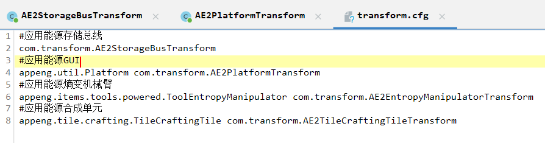
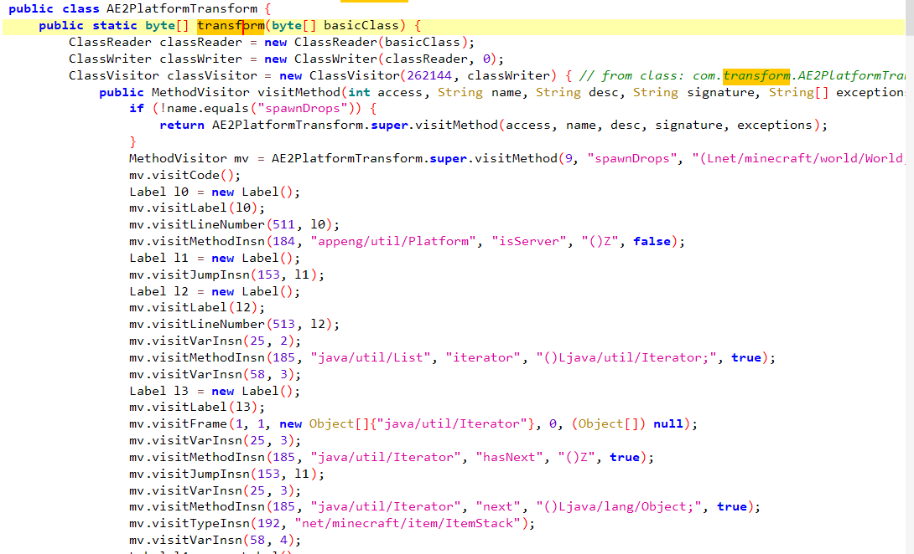
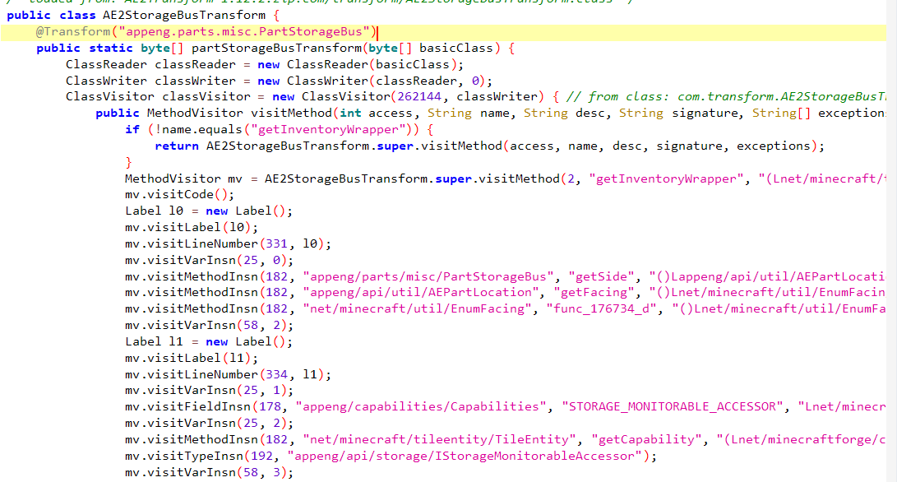
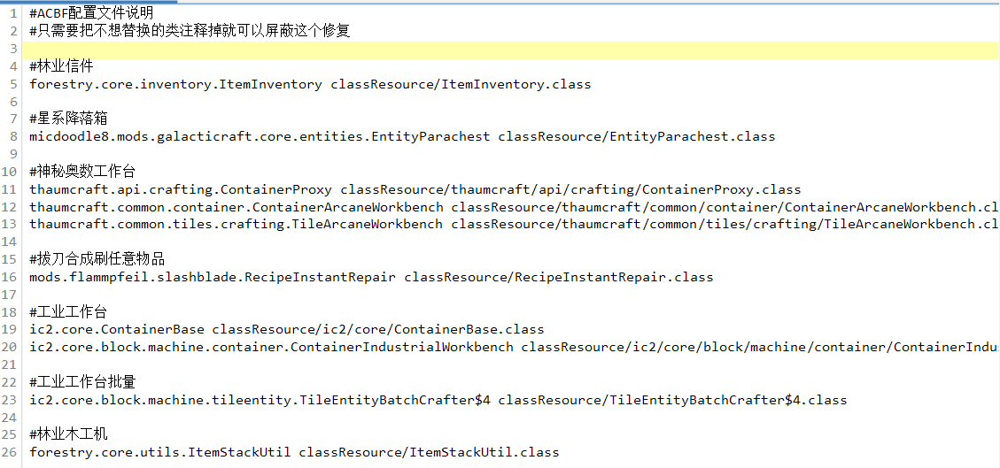
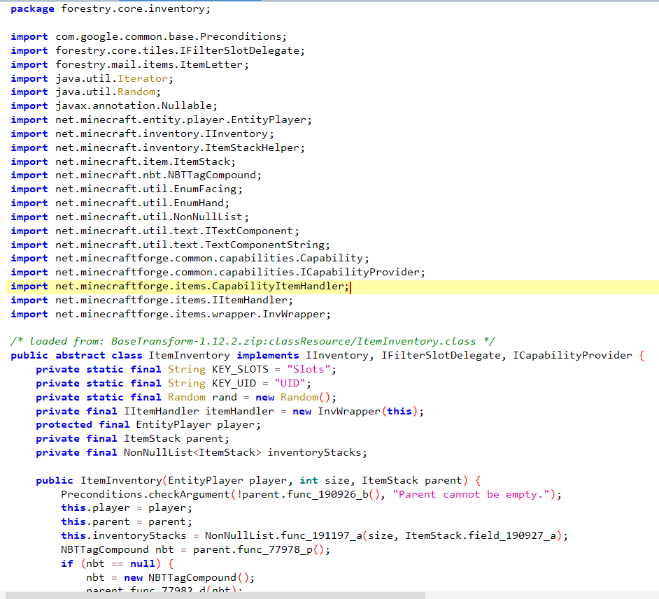
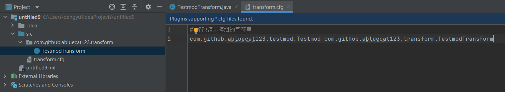
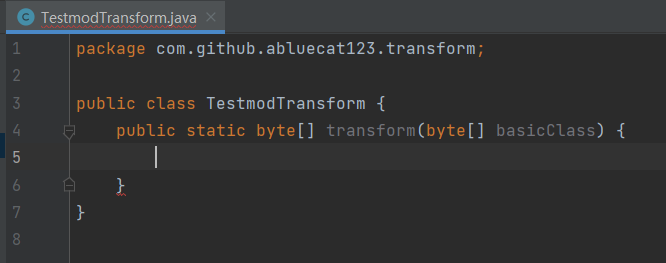
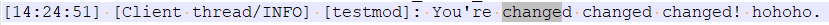

## Coremod 初探及ACBF扩展包编写

?> **前置知识声明** 在阅读本节前，请至少阅读以下内容：  
[1] 本教程的前三部分；  
[2] [原版 / FML CoreMod 开发教程](https://xfl03.gitbook.io/coremodtutor/readme) by xfl03, ZekerZhayard 等；  
此外，以下内容也十分推荐阅读，尽管部分内容可能有过时，但在本节的阅读中依然十分有帮助：  
[1] [基于FML的MinecraftMod制作教程 Extra编(3) – Coremod的制作](http://blog.hakugyokurou.net/?p=333) by szszss；  
[2] [俩车的 Coremod 介绍](https://www.mcbbs.net/thread-849970-1-1.html)；  
[3] [Coremod导论—从切比雪夫多项式说起](https://www.mcbbs.net/thread-822754-1-1.html)。

Coremod 是一种在 Minecraft 正常启动、Minecraft 和普通模组代码被加载前提前被加载的模组<sup>[注1]</sup>，这使得我们可以通过这个渠道对游戏或模组的字节码进行修改等较高级、也较危险的操作。事实上，鉴于Coremod的不安全性，本教程并不是很建议读者使用编写Coremod的方式来做 PJ1，但笔者在此仍然介绍 Coremod，存在两个目的：

1. 对前三部分的内容进行一个运用式的总结；
2. 学习编写 Another Common Bug Fix 的扩展包。

Another Common Bug Fix 是一款开源的、应用广泛的通用 bug 修复模组，其本体就是一个 Coremod 。该模组通过加载作者提供的一个个“修复包”，修复包内的对字节码操作的 ObjectWeb ASM 代码便注入到原有的字节码中，从而达到修改游戏的目的。由于其结构简单，在较为火热的中低版本（1.7.10、1.12.2）提供了份简单的解决方案，因此本文来探讨编写 ACBF 扩展包的方式。

对于更高版本的游戏，有更安全的替代品：Mixin。

注意：当你继续往下阅读时，将默认你已经看过了前置知识。后文将在视为你已理解前置知识的基础上进行讲解。

#### 本篇目的：
* 剖析 ACBF 模组的结构，并学习编写其扩展包。

### 一、ACBF 的结构
[ACBF](https://github.com/IslenautsGK/AnotherCommonBugFix) 是一款开源的 mod，其主体就是 3 个类文件：
* **载入入口类** `AnotherCommonBugFix.java`，它作为 Coremod 的一个载入入口，由 `MANIFEST.MF` 文件指定。其作用是指定 Mod 容器 `ModContainer` 和类转换器 `IClassTransformer` 的位置。
* **Mod容器类** `ACBFModContainer.java`，它定义了该 Coremod 的一些信息。可以感性理解为**普通模组**中 `mcmod.info` 文件和 mod 主类的作用（Coremod没有这两个东西）。同时，由于 Coremod 没有主类，注册入子总线的工作也需要开发者手动进行。此外，该类还定义了一些网络通信的方法，用来确保服务端和客户端的修复包组成相同。
* **类转换器** `ACBFClassTransformer.java`，它集合了保存载入配置文件、创建`fixResource`文件夹、读取修复包等功能。

对于修复包，`transform.cfg`是其入口。分析`loadFixPackets`方法的逻辑，配置按行读取，一行只有一个字符串时，为按 **@Transform注解注入** （可参考下图中的`AE2StorageBugTransform`类）。该注解在`api\java\com\anotherera\core\Transform.java`内定义，使用时传入目标类位置作为参数。这样修复方法的方法名便可任意自定义了。

如果一行有两个字符串，按注入类字符串（第二个字符串）的格式定。如果是 Java 类命名格式，则为按 **正常transform方法注入** （可参见下图中的AE2PlatformTransform类）。和前者不同的一点是后者一般只对一个类修改，且方法名必须为`transform`（内部类`TransformResource`里面定义了方法名）

如果是按文件夹命名的格式，则：
* 如果是`.js`结尾，则为使用 JavaScript 脚本方式修改。然而作者并没有写这类修复方式，因此本文也不做介绍。
* 如果是`.class`结尾，则为**类替换方式**修改（可参考下图中的`ItemInventory`类）。这方法是直接把原类替换成新类。这种方法因为兼容性问题被作者不推荐使用。











在讲解完其加载修复包的方式后，我们就可以编写扩展包了。下文通过按正常的编写`transform`方法的形式写。

[下载演示文件](https://github.com/ABlueCat123/REtutorial/blob/main/Practice/Lesson1_2)

!> **提醒** 在获得演示文件时请**谨慎**对比演示文件信息，以免收到不受信任的文件。

演示文件信息：

包含 2 个文件:
- testmod-1.0-SNAPSHOT.jar
- TestmodTransform.zip

testmod-1.0-SNAPSHOT.jar信息:

`SHA256: 7f33c4a0af12ee9ca169fc63b9f508e20a16a7783e53c95b365626196e67d51f`
`MD5: 3b89745e3b9ecf6b6a547d364a93b42e`

TestmodTransform.zip信息:

`SHA256: f63151d47803a14b4b7b81cff07b4cbca579e3f9ff3a7e803d69b6d6ca1a9af9`
`MD5: 9373fea287286730ef122289fd0e9459`

这是一个适配于Minecraft 1.12.2的Forge模组，只有一个功能：输出`Change Change me, hahaha`


首先新建一个Maven Java工程，在src文件夹下创建一个`transform.cfg`，添加以下内容：（下图中当时忘了创建为Maven工程了，后面引入的）



前一个字符串为被注入类的全限定类名，后一个为注入类的。

注入类里面需要实现一个`transform`方法，传入一个`byte[]`，返回一个`byte[]`，这个在源代码中已经定义了。



Maven配置文件内，引入ASM依赖：

```xml
    <properties>
        <asm.version>8.0.1</asm.version>
    </properties>

    <dependencies>
        <dependency>
            <artifactId>asm-commons</artifactId>
            <groupId>org.ow2.asm</groupId>
            <version>${asm.version}</version>
        </dependency>

        <dependency>
            <artifactId>asm-util</artifactId>
            <groupId>org.ow2.asm</groupId>
            <version>${asm.version}</version>
        </dependency>
    </dependencies>
```

之后便可以利用第三部分所讲述的字节码修改技术着手修改了。填入以下代码：
```java
    public static byte[] transform(byte[] basicClass) {
        ClassReader classReader = new ClassReader(basicClass);
        ClassWriter classWriter = new ClassWriter(classReader, 0);
        ClassVisitor classVisitor = new ClassVisitor(Opcodes.ASM4, classWriter) {
            @Override
            public MethodVisitor visitMethod(int access, String name, String descriptor, String signature, String[] exceptions) {
                if (!name.equals("init"))
                {
                    return this.cv.visitMethod(access, name, descriptor, signature, exceptions);
                }
                MethodVisitor mv = this.cv.visitMethod(access, name, descriptor, signature, exceptions);
                AnnotationVisitor anv = mv.visitAnnotation("Lnet/minecraftforge/fml/common/Mod$EventHandler;", true);
                anv.visitEnd();
                mv.visitCode();
                mv.visitLdcInsn("testmod");
                mv.visitMethodInsn(INVOKESTATIC, "org/apache/logging/log4j/LogManager", "getLogger", "(Ljava/lang/String;)Lorg/apache/logging/log4j/Logger;", false);
                mv.visitVarInsn(ASTORE, 2);
                mv.visitVarInsn(ALOAD, 2);
                mv.visitLdcInsn("You're changed changed changed! hohoho.");
                mv.visitMethodInsn(INVOKEINTERFACE, "org/apache/logging/log4j/Logger", "info", "(Ljava/lang/String;)V", true);
                mv.visitInsn(RETURN);
                mv.visitMaxs(2, 3);
                mv.visitEnd();
                return null;
            }
        };
        classReader.accept(classVisitor, Opcodes.ASM4);
        return classWriter.toByteArray();
    }
```

ASM API版本使用ASM4即可（官方的包也使用ASM4）。

然后就是，只修改``init()``方法里面的字符串，因此如果不是该方法就原封不动地退还回去即可。

对于目标方法，用直接替换的方式将其字节码替换掉即可。构建后得到的构建包的后缀名改为`.zip`扔入`fixResource`文件夹即可。

结果：



### 习题：
1. 众所周知，植物魔法的拉普达碎片在服务器里面是一种几乎必 ban 的道具 —— 它能无视插件方所提供的保护，对地形造成难以逆转的破坏。

然而，**血魔法2**模组添加了“拉普达法阵”，该法阵与拉普达碎片产生的效果一致。且因为**某种原因**（该原因需要读者自行探究），无法通过类似于 CraftTweaker / ModTweaker 等方式简单修正（当然如果真的有完美的修正方式请务必教育笔者）。除了禁用奥术粉灰貌似别无他法。但禁用这个可以说血魔法的可玩性也基本上没了。

幸而，这个模组是**开源**的，找到源代码很容易。然而，由于其前置模组 Guide-API 所在的 [maven 服务器](http://tehnut.info/maven/)已然下线，这意味着寻找 deobf 版本的前置模组来通过正常手段构建貌似已经变得不太可能（当然如果真的有构建方式请务必教育笔者）。因此我们必须得想点其他办法来完成修改的目的。

而对你来说，使用编写 ACBF 扩展包的方式，把这个法阵从游戏里抹除吧！

提示：

反编译结果可以看出，这个模组本身并未经过混淆。那么一些特定的**名词、原料等**对定位可能会有帮助，比如**青金石块**是该法阵的标志性原料。

成品：

[BloodMagicTransform——血魔法拉普达法阵禁用](https://www.mcbbs.net/thread-1377781-1-1.html)

本篇参考资料：
1. 所有在“前置知识声明”部分出现过的文章。
