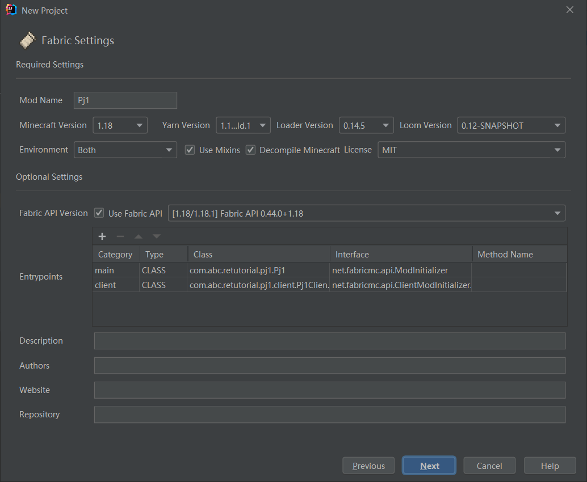
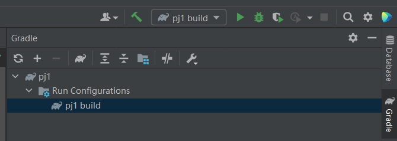
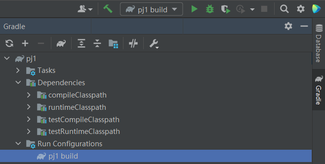
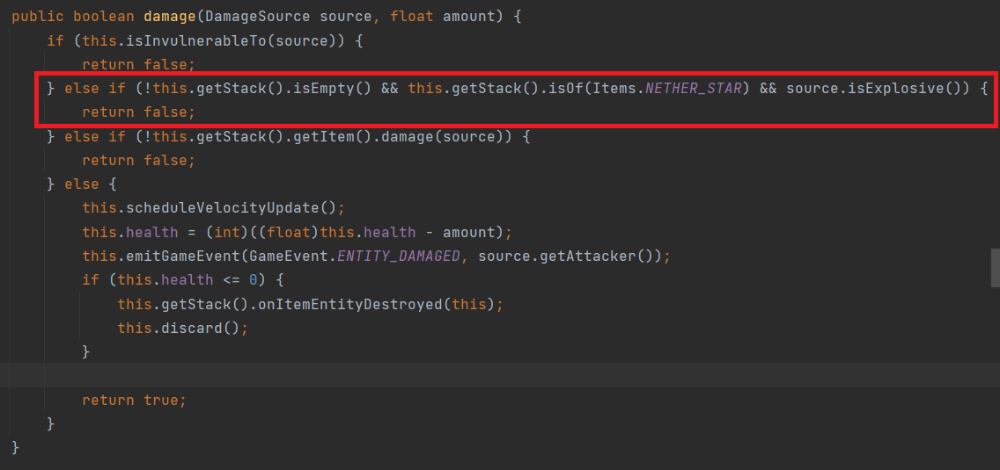
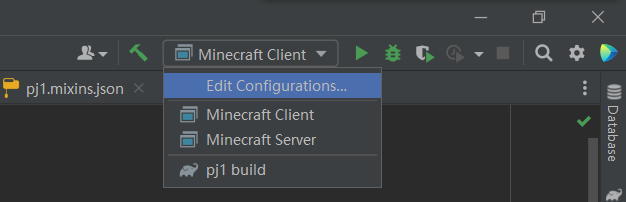

## Mixin 及其应用

?> **前置知识声明** 在阅读本节前，请至少阅读以下内容：  
[1] 本教程的前三部分；  
[2] [Mixin官方Wiki中文翻译](https://mouse0w0.github.io/categories/Mixin/)  
此外，以下内容也十分推荐阅读：  
[1] [在Minecraft Forge中使用Mixin](https://mouse0w0.github.io/2022/03/01/Mixins-on-Minecraft-Forge/)
[2] [由现象到本质的Minecraft源码注入艺术](https://www.mcbbs.net/thread-1205392-1-1.html)

我觉得CoremodTutor 和 由现象到本质的Minecraft源码注入艺术 两篇教程已经很好地讲解了Mixin的工作原理，实在没必要重复造轮子，对于其介绍就直接引用吧：

> Mixin 可以让CoreMod开发者从硬核地修改字节码中解放出来,用标准的Java代码来修改Minecraft，并且在LiteLoader、Fabric中成为推荐的修改Minecraft的方式。 —— CoremodTutor

在社区内对于Mixin的资料十分地多，读者可善用搜索引擎查找详细资料。本文从实践的角度来介绍一下关于使用Mixin实现“取消下界之星的爆炸保护”功能。

#### 本篇目的：
* 使用Mixin实现“取消下界之星的爆炸保护”功能。

### 第一步 创建工程
首先创建Fabric工程，可参考的配置如图：


### 第二步 换源(可选)
打开settings.gradle, 把`https://maven.fabricmc.net/`修改为`https://lss233.littleservice.cn/repositories/minecraft`，若更换下载源后出现下载失败的问题，可以更换回来。

### 第三步 构建
点击右侧的`pj1 build`(若没有，可以点击最右边的`Gradle`调出)，等待构建过程。


然后，点击`Reload All Gradle Projects`，等待下载文件。

?> **要耐心** 这一步可能会反复出错导致构建失败，且等待时间很漫长，如果失败可以尝试多试几次。

当你看到这些的时候，证明你构建成功了：


### 第四步 定位

我们思考，在**实体状态**下的下界之星并不会因为爆炸而导致摧毁，故我们很容易想到要找ItemEntity类，找到damage方法：



非常明显了：只要伤害来源是爆炸，且物品是下界之星，就不摧毁它。既然明白了工作原理，只要我们去掉这个判断就成了。

### 第五步 编写代码
我们在主类所在的文件夹创建一个`mixin`子包，里面创建一个名为`ItemEntityMixin`的类，内容如下：

```java
package com.abc.retutorial.pj1.mixin;

import net.minecraft.entity.Entity;
import net.minecraft.entity.EntityType;
import net.minecraft.entity.ItemEntity;
import net.minecraft.entity.damage.DamageSource;
import net.minecraft.item.ItemStack;
import net.minecraft.world.World;
import net.minecraft.world.event.GameEvent;
import org.spongepowered.asm.mixin.Mixin;
import org.spongepowered.asm.mixin.Overwrite;
import org.spongepowered.asm.mixin.Shadow;

@Mixin(ItemEntity.class)
public abstract class ItemEntityMixin extends Entity {

    public ItemEntityMixin(EntityType<?> type, World world) {
        super(type, world);
    }

    @Shadow public abstract ItemStack getStack();
    @Shadow private int health;
    /**
     * @author ABlueCat
     * @reason A suggested example for Project 1 Warm-up.
     */
    @Overwrite()
    public boolean damage(DamageSource source, float amount) {
        if (this.isInvulnerableTo(source)) {
            return false;
        } else if (!this.getStack().getItem().damage(source)) {
            return false;
        } else {
            this.scheduleVelocityUpdate();
            this.health = (int)((float)this.health - amount);
            this.emitGameEvent(GameEvent.ENTITY_DAMAGED, source.getAttacker());
            if (this.health <= 0) {
                this.getStack().onItemEntityDestroyed((ItemEntity) (Object)this);
                this.discard();
            }

            return true;
        }
    }
}
```
为了让模组能正常运行，主类也应该实现`onInitialize()`方法(虽然什么都不用做)：
```java
package com.abc.retutorial.pj1;

import net.fabricmc.api.ModInitializer;

public class Pj1 implements ModInitializer {

    @Override
    public void onInitialize() {

    }
}
```
然后，删除fabric.mod.json中client部分和client类，就写完了这个模组。

接下来把启动配置改成`Minecraft Client`，点击运行键，就可以看看效果了！



最终效果：

<iframe height=516 width=856 src="pj1/video/pre.mp4">

本篇参考资料：
1. 所有在“前置知识声明”部分出现过的文章。
