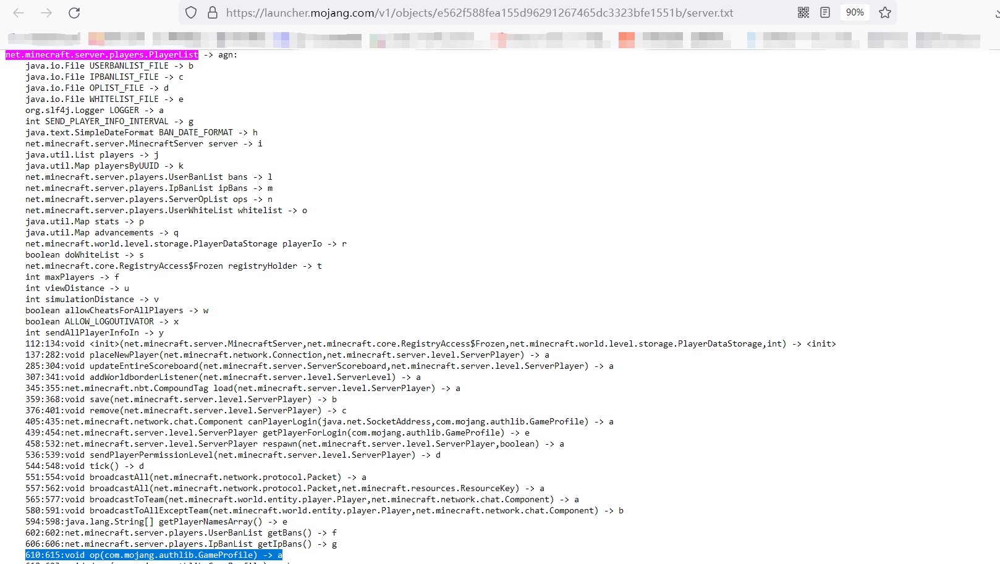

## Coreplugin 导论

?> **前置知识声明** 在阅读本节前，请至少阅读以下内容：  
[1] 本教程的前三部分；  
本篇建立在以下篇目的基础上：  
[1] [Forge有Core Mod, 我们有 Core Plugin! 深度魔改核心教程](https://www.mcbbs.net/thread-1333699-1-1.html)

在笔者曾经就职mcbbs编程开发版版主的时候，遇到了名为CorePlugin的开发教程的评级申请。然而其虽名为教程，作者却没有对其进行详细介绍，只是给了一个代码仓库，因此其评级申请并未获得通过。但CorePlugin的概念却十分有趣。本文做一个导论性质的介绍，抛砖引玉，如果读者有所启发，可以在这方面多做工作，从而写一篇全新的教程。

在此，对CorePlugin概念的提出者及作者VeroFess表达感谢。

#### 本篇目的：
* 认识CorePlugin。

### CorePlugin 介绍
与Coremod相似，CorePlugin是一种对核心和其他插件进行修改的插件。在该作者的实现上，该插件做到了往核心插入`PlayerOpEvent`这一事件，当一个玩家获得OP权限时将触发该事件。

分析项目结构，可发现其大致可分为两个部分：jhook部分和sample部分。

jhook部分为工具部分，主要负责在JVM层面充当在字节码即将被载入的时候劫持并修改原生字节码的“黑旅店”。也就是类似于FML的功能。

sample部分则为插件部分。

`PlayerListModifier`类获取一份`PlayerList`类的字节码，它在装入该类的前一刻，向里面的名称为`a`，方法描述符为`(Lcom/mojang/authlib/GameProfile;)V`的方法里注入了调用`EventFireHelper`类中静态方法`firePlayerOpEvent`的内容。通过查询官方混淆映射表所知，这个方法正是设置OP时所调用的`op`方法。这意味着被修改后的`PlayerList`类将会在设置OP时调用`firePlayerOpEvent`方法，call 自定义的`PlayerOpEvent`，并在`PlayerOpEvenListener`（原文如此，可能应为`PlayerOpEventListener`）监听此事件后通知一名玩家被设置了OP。这做到了类似于Coremod修改核心乃至其他插件的字节码的作用。

图为官方混淆映射表中的目标方法

### 缺陷及展望
通过分析整个过程，我们可以看到，该插件确实能做到在一个类**未被载入前**进行修改的可能性。

按照传统的 Coremod 运行机制，它是在游戏相关类的字节码被 ClassLoader 加载到 cache 之前就被 FML 加载并提前部署好，等目标类预备加载时守株待兔般劫持字节码文件并对其修改。这也是编写 Coremod 时不能随意调用 Minecraft 原有的类、其他普通模组的类乃至于 Coremod 自身的普通 mod 部分类的原因。

然而对于CorePlugin，和普通插件一样，是在运行时被 spigot 正规调用。在原版的 CorePlugin 插件里甚至都没有 loadbefore 属性来规范调用的先后顺序。所以必然存在若干个类在 CorePlugin 加载前就已经被加载了，而这些类将不可被 CorePlugin 修改，这可能会导致未知的后果（如部分类未能被其修改等等）。

此外，CorePlugin 也继承了 Coremod 的缺点，即对字节码直接操作所带来的不稳定性和某种意义上的可扩展性较低。

不过在笔者看来，这个概念有着光明的未来。也希望读者对这个概念进行更深入的思考。

本篇参考资料：
1. 所有在“前置知识声明”部分出现过的文章。
