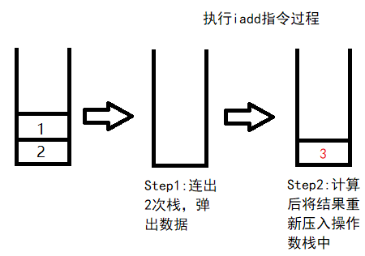

## Java运行机制概述
由于Java语言是Minecraft的实现语言，同时其本身具有易于逆向的特点，因此Java语言是本教程的主讲语言。在开始正式讲解逆向工程之前，了解Java语言的运行机制是必要的。
#### 本篇目的：
* 认识Java语言的编译原理
* 认识Java虚拟机(Java Virtual Machine, JVM)

### 一、“一次编译，处处运行”的语言

开发者写代码的根本目的，是要让计算机理解开发者的意图、并执行相应的指令。以执行方式的不同，可将编程语言分为**编译型语言**和**解释型语言**[注1]。

Python就是一种解释型语言，即在运行的过程中把源代码直接解释执行。这种语言具有跨平台的特点，即只需要分发源代码，即可在各种发行版本的解释器上执行成同样的效果。但由于每次执行代码都需要重新解释，故相对于编译型语言，其执行效率并不高。

对于C++等语言来说，它们属于编译型语言，在运行前必须将源代码编译成为可执行文件[注2]。然而由于操作系统、CPU架构等的不同，可执行文件并不能在这些机器上都通用执行。下图展示了对于同一份源代码而言，CPU架构的差异导致的指令集、机器码的差异。(鼠标悬停在图片上可看图片介绍)

<figure class="thumbnails">
    
    
</figure>

<figure class="thumbnails">
    
    
</figure>

因此，对同一软件来说，发布多种发行版本是解决这个问题的办法。

而对于Java语言，其执行过程结合了**编译**和**解释**[1][2]两个过程。

编译过程由Java编译器(`javac`)完成，它将Java高级语言代码(`.java`)文件编译为Java字节码(`.class`)文件。字节码相对源代码而言更贴近于机器语言，呈现了一些类似于汇编语言的特征。但字节码代码与汇编代码不同，它具有**体系结构中立**的特点。同一份字节码程序可以由任何不同平台、安装于不同CPU环境的Java虚拟机解释执行，且执行效果完全一样。

解释过程由Java虚拟机(Java Virtual Machine, JVM)完成。JVM本质上是一个程序，靠解释执行字节码指令来最终完成对计算机的操作。

正因为Java同时具备编译型语言和解释型语言的优点，所以它被称为**一次编译，处处运行**的语言。

### 二、JVM简介
Java虚拟机是解释执行Java字节码程序的场所。本文将大致介绍一下JVM对字节码的执行过程。

?> **提示** 考虑到本文介绍的重点，在此并不详细介绍JVM工作原理。若需要了解详细信息，请参阅本文参考资料。

首先，JVM会对字节码程序进行**类加载**，这一过程在类加载子系统中完成。类加载过程分为加载、链接和初始化三个步骤，其中链接可再分为验证、准备、解析三个子步骤：
* **加载**。这一过程的任务是：对任意一个类，都在内存中生成一个对应的`java.lang.Class`对象。该过程通过**类加载器**(ClassLoader)完成，而类加载器既可以是JVM内置的类加载器，也可以是用户自定义的类加载器。当存在多种类加载器时，JVM将采用名为“双亲委派”的机制来加载类，以确保`java.lang.Class`对象会且只会生成一次。此机制可保证一些重要的类不被篡改。最终得到的`Class`对象可作为这个类的各种数据的访问入口。
* **验证**。这一过程验证Java字节码文件的合法性。由于字节码文件的产生来源是多样的，因此JVM对字节码进行验证，确保其不会包含一些对虚拟机系统产生危害的二进制代码。
*  **准备**。这一阶段主要是创建类和接口的静态字段分配内存、设置初值。
*  **解析**。这一阶段JVM根据运行时常量池的符号引用来动态决定具体值的过程。
*  **初始化**。这一阶段对类和接口来说，即执行其初始化方法。初始化方法，即`<clinit>()`方法[6]，由JVM自动生成，它会收集所有的`static{}`块、静态类变量的赋值等操作，并按出现的顺序执行。值得注意的是，初始化方法和构造方法是两个不同的概念。后者是当类的对象创建时调用的方法。实际上，对于构造方法来说，其本质上是`<init>()`方法。

执行字节码的过程是在Java虚拟机字节码执行引擎中完成。虚拟机以方法作为其基本执行单元，而调控其执行顺序的结构是**虚拟机栈**，其每一个**栈帧**都提供了方法的运行空间。栈帧包含：
* **局部变量表**。它存放了方法的参数和内部定义的一切局部变量。
* **操作数栈**。这个栈是在运行过程中，由字节码指令往其中压入或弹出数据来实现数据的运算。如指令`iadd`，便是需要将操作数栈栈顶的两个数出栈、相加后重新入栈。这一过程有点类似于用栈实现的后缀表达式的计算过程。由于栈这一数据结构具有FILO(First In Last Out, 先进后出)的特点，因此操作数序列和字节码指令序列必须严格匹配。下图大致展示了操作数栈的操作过程：

* **动态连接**。在进行方法调用时，指向的方法的符号引用都会存在于常量池中。这些符号引用一部分在类加载阶段或第一次使用时便被转为直接引用，而另一部分则是在每次调用时转化为直接引用，而后者便被称为动态连接。
* **方法返回**。在方法退出时，一般存在正常退出和异常退出两种退出方法。一般来说，遇到与返回相关的字节码指令后便是正常退出，此时可能会携带一些返回值到上层方法中。而异常退出则是在处理过程中遇到了异常，而此异常未能得到处理，此时也会直接退出该方法。不过无论如何，都会返回到调用该方法的位置(即上层方法)，以供程序继续执行。

最后讲解JVM的退出机制。在调用了System类的exit()方法，或Runtime类的exit或halt方法后，若Java安全管理器允许此次退出操作，则JVM将退出。

### 习题：
1. 思考通过javac编译获得的字节码文件相对于使用gcc/g++等编译器编译得到的汇编代码有什么特点？
2. 思考JVM在整个执行周期中，是如何确保字节码程序能安全稳定地运行的？
3. 阅读参考资料中相关文献，对JVM的结构进行进一步认识。

本篇参考资料：
1. 《Java语言程序设计 基础篇 原书第10版》 Y.Daniel Liang著
2. 《编译原理 第二版》 Alfred V. Aho等著
3. 《深入理解JAVA虚拟机：JVM高级特性与最佳实践（第3版）》 周志明著
4. 《Java虚拟机规范》 Tim Lindholm等著，笔者参考了爱飞翔、周志明等的译本(Java SE 8)以及Java 18的虚拟机规范：https://docs.oracle.com/javase/specs/jvms/se18/html/index.html
5. 通俗易懂的双亲委派机制 https://blog.csdn.net/codeyanbao/article/details/82875064
6. https://docs.oracle.com/javase/specs/jvms/se18/html/jvms-2.html#jvms-2.9.2

注释：
1. 实际上，编译型语言和解释型语言的界限并不是绝对的。市面上便有许多款Python的编译器，同时也存在着C语言的解释器。
2. 这里说的实际上很笼统。整个执行过程实际上分为很多步，而编译只是其中的一步罢了。若想了解完整的执行过程，请参考《编译原理》这本书。