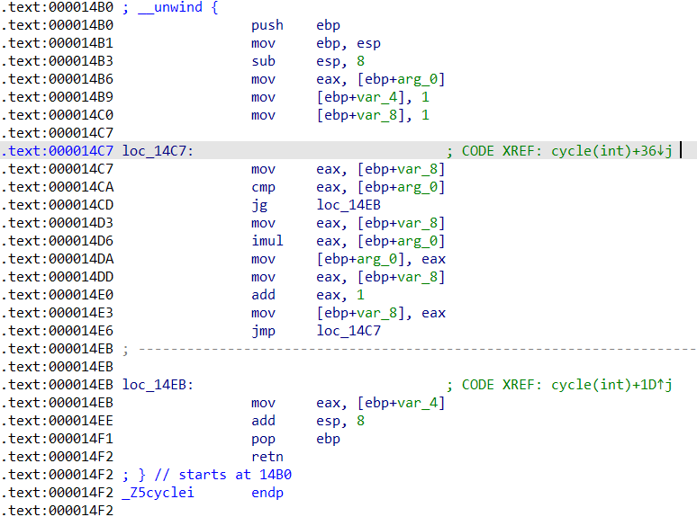
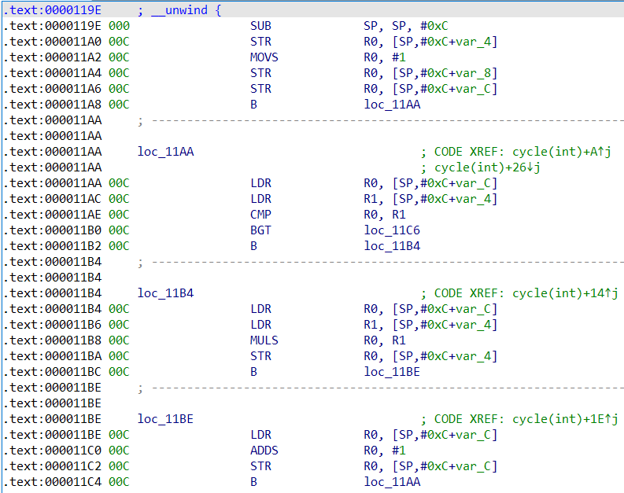

## Java运行机制概述
由于Java语言是Minecraft的实现语言，同时其本身具有易于逆向的特点，因此Java语言是本教程的主讲语言。在开始正式讲解逆向工程之前，了解Java语言的运行机制是必要的。
#### 本篇目的：
* 认识Java语言的编译原理
* 认识Java虚拟机(Java Virtual Machine, JVM)

### 一、“一次编译，处处运行”的语言

开发者写代码的根本目的，是要让计算机理解开发者的意图、并执行相应的指令。以执行方式的不同，可将编程语言分为**编译型语言**和**解释型语言**[注1]。

Python就是一种解释型语言，即在运行的过程中把源代码直接解释执行。这种语言的好处是具有跨平台的特点，即只需要分发源代码，即可在各种发行版本的解释器上执行成同样的效果。但由于每次执行代码都需要重新解释，故执行效率并不高。

对于C++等语言来说，它们属于编译型语言，在运行前必须将源代码编译成为可执行文件[注2]。然而由于架构的不同，可执行文件并不是体系结构中立的。即如果你把Windows平台上的可执行文件放到Ubuntu系统上便不可正常运行。并且，CPU的差异也可能会导致指令集的不同。

<figure class="thumbnails">
    
    
</figure>

和任何其他语言一样，对于Java语言，它的源代码并不是可以直接执行的。从高级语言代码到可被机器执行的指令集的过程可分为两个步骤：**编译**和**解释**[1][2]。

编译由Java编译器完成，它将代码编译为一个后缀名为.class的Java字节码文件(Java bytecode)，字节码相对源代码而言更贴近于机器语言，但也不能直接执行，而是需要由Java虚拟机解释执行。Java虚拟机并不是一个物理机器，而是一个程序。事实上，在我们玩MC时安装Java的Java运行时环境(Java Runtime Environment, JRE)就包括了JVM的实现。由于字节码文件是体系结构中立的，也就是说同一份字节码程序可以由任何Java虚拟机执行，且执行效果一样。这点保证了Java语言良好的跨平台性，也就是为什么Java语言“一次编译，处处运行”了。

### 二、反编译器介绍

反编译器是逆向人员的最重要的朋友之一。它能将字节码文件直接反编译为高级语言代码，使得程序的运行机制一览无余。Java的反编译器种类多种多样。本文将介绍三种反编译器的使用：

#### Jd-gui

对于长期处于一线的反后门人员来说，Jd-gui的使用是很常见的。

jd-gui

使用起来很简单：只需要把需要反编译的文件拖拽到它的窗口内就行了。

#### IDEA-Decompiler

对于使用IntelliJ IDEA的开发者，你的IDEA就可以是一个反编译器！

打开任意一个工程，把**解压后的**jar的文件夹内容复制到该工程范围下，就可以直接点击.class文件读源代码了。

IDEA反编译

#### jadx

Jadx是一个功能强大的、实用的、免费的反编译器。它甚至支持反编译apk文件，且它反编译效率高、反编译出来的代码质量好。

!> **注意货比三家!** 反编译器种类繁多、反编译出来的代码质量、可读性等都存在差异。**没有一款绝对最强的反编译器**。因此，注意货比三家，使用不同的反编译器来反编译代码，是逆向工程中的黄金法则。

### 习题一：

[下载习题文件](https://github.com/ABlueCat123/REtutorial/blob/main/Practice/Lesson1_1)

!> **提醒** 在获得习题文件时请**谨慎**对比习题文件信息，以免收到不受信任的文件。

习题文件信息：

包含 1 个文件:
- Lesson1_1.zip

Lesson1_1.zip信息:

`SHA256: 656f5ce326c5cec593be52ac89d36bd969c3f8023307bf66057731a0a9cd547b`
`MD5: b2d4e305bb27499716eab09c11ccb4af`

任务：
* 解压缩文件`Lesson1_1.zip`，得到`Lesson1_1.jar`和文件夹`Lesson1_1`；
* 反编译插件`Lesson1_1.jar`，并大致理解该插件的含义；
* 使用IntelliJ IDEA打开该插件的工程项目文件`Lesson1_1`，根据反编译结果完成工程文件中**缺失**的部分，并**构建**它。

### *习题二：

任务：
* 使用**至少三种**不同的反编译器反编译任意一份jar包(jar包可以在mc的目录下轻易找到)，对比反编译的代码质量。

本篇参考资料：
1. 《Java语言程序设计 基础篇 原书第10版》 Y.Daniel Liang著
2. 《编译原理 第二版》Alfred V. Aho等著
3. Cifuentes, Cristina Garcia and Kevin John Gough. “Decompilation of binary programs.” Software: Practice and Experience 25 (1995): n. pag.
4. jd-gui: https://github.com/java-decompiler/jd-gui
5. IntelliJ IDEA官网: https://www.jetbrains.com/idea/
6. jadx: https://github.com/skylot/jadx/

注释：
1. 实际上，编译型语言和解释型语言的界限并不是绝对的。市面上便有许多款Python的编译器，同时也存在着C语言的解释器。
2. 这里说的实际上很笼统。整个执行过程实际上分为很多步，而编译只是其中的一步罢了。若想了解完整的执行过程，请参考《编译原理》这本书。