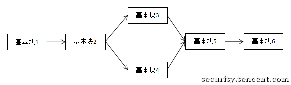
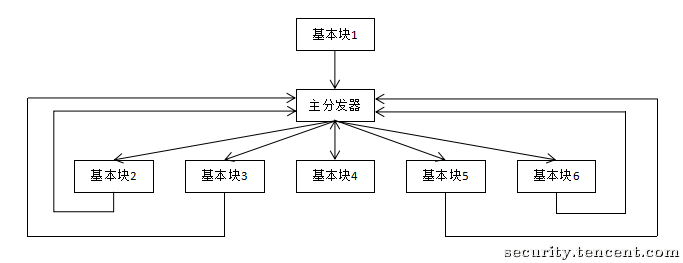
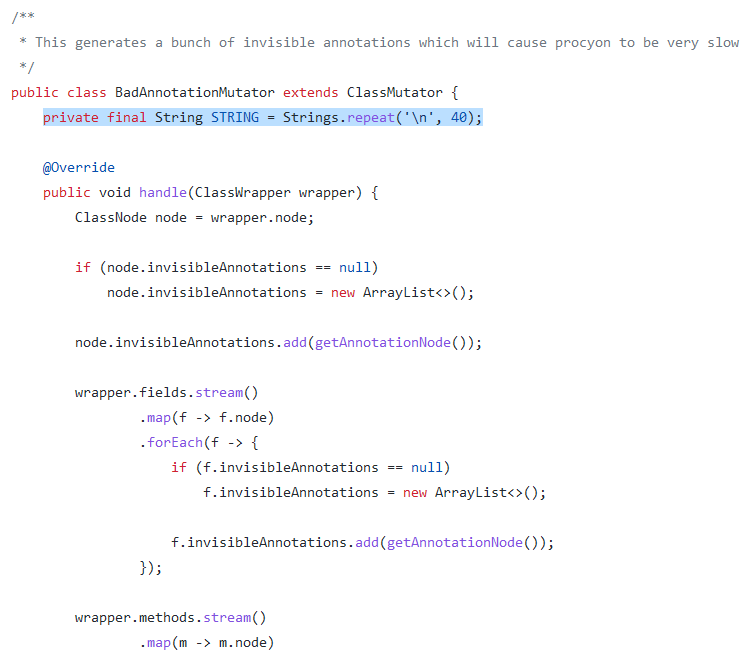
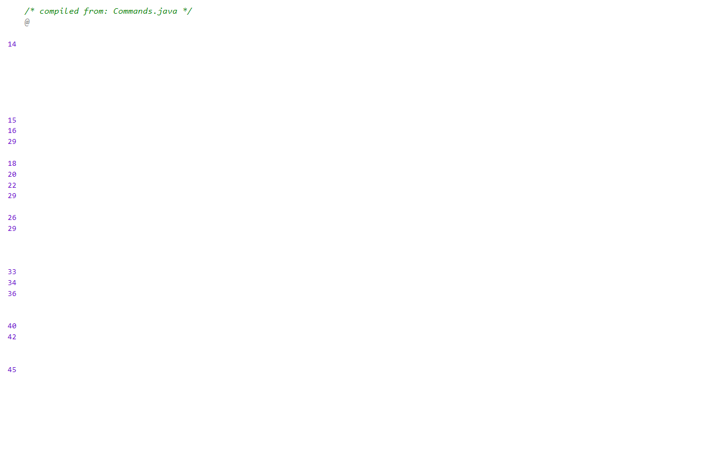
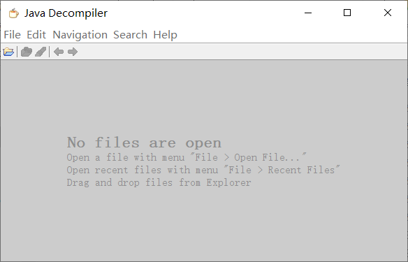
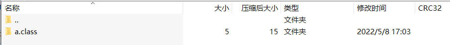
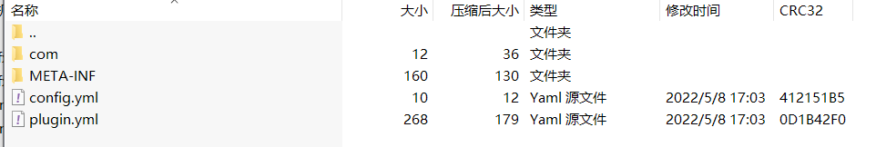

## 三、混淆与反混淆

在部分情况下，出于对自己代码保护、防止他人剽窃、阻止未授权的逆向行为等种种目的，开发者会采用种种手段来阻止逆向工程的进行。

 **混淆(Obfuscate)** 就是一种有效的阻止逆向过程的手段。指在代码中加入冗余的、错误的、难以理解的指令；改变程序结构使其可读性降低等等手段，使代码将变得更不易阅读、提高逆向人员理解代码的成本、误导或欺骗逆向人员。在部分极端情况下，混淆可以使反编译器崩溃、出错等等，使得代码更加安全。

 混淆要满足以下两个原则：
 
 * **语义不变原则**。即在任何情况下混淆不能改变代码的原意，混淆代码要和原代码实质等价。
 * **复杂性原则**。即混淆后的代码需要比未混淆的代码更加难以理解。

本篇将主要介绍混淆技术、常用的混淆器和反混淆技术。

## 混淆介绍

### 1.标识符更改

通过把常见的、易理解的标识符更改成费解的、无意义的标识符，使得代码可读性降低。

```java
    public int find(int x)
    {
        if (parent[x] != x)
        {
            parent[x] = find(parent[x]);
        }
        return parent[x];
    }
```
<center>混淆前</center>

```java
    public int f1(int f2)
    {
        if (f3[f2] != f2)
        {
            f3[f2] = f1(f3[f2]);
        }
        return f3[f2];
    }
```
<center>混淆后</center>

值得注意的是，事实证明，大部分插件/mod只需进行标识符更改后就基本上达到混淆的目的了，因为大部分逆向人员都被劝退了。因为他们可能看到的是这样：
```java
    public int liIlIil1iL(int iii1liLllij)
    {
        if (i1i1llilLil[iii1liLllij] != iii1liLllij)
        {
            i1i1llilLil[iii1liLllij] = liIlIil1iL(i1i1llilLil[iii1liLllij]);
        }
        return i1i1llilLil[iii1liLllij];
    }
```
<center>混淆后</center>

评价：这是最常见、最简单也是最不浪费运行资源的混淆方式。绝大部分通用混淆器都会提供标识符混淆的功能。
### 2.变量位分离与位合并
对于一个整型变量a，以它是一个8位二进制数为例，在存储的时候可以将其每一位分成8份分别存在8个变量里面，而取用的时候使用小小的计算即可还原a。而这样的8个变量可以存放8个整型变量。

下面是变量位分离的一个实现：
```java
    public static void main(String[] args) {
        int[] a = new int[8];
        int[] b = new int[8];
        Scanner sc = new Scanner(System.in);
        for (int i = 0; i < 8; i++)
        {
            a[i] = sc.nextInt();
        }
        save(a, b);
        System.out.print("加密后的b数组:");
        for (int i = 0; i < 8; i++)
        {
            System.out.print(b[i]);
            System.out.print(" ");
        }
        for (int i = 0; i < 8; i++) //清除a数组原有数据
        {
            a[i] = 0;
        }
        load(a, b);
        System.out.print("\n解密后的a数组:");
        for (int i = 0; i < 8; i++)
        {
            System.out.print(a[i]);
            System.out.print(" ");
        }
    }
    private static void save(int[] a, int[] b)
    {
        for (int i = 0; i < 8; i++)
        {
            for (int j = 0; j < 8; j++)
            {
                if ((a[i] & (1 << j)) == (1 << j))
                {
                    b[j] ^= (1 << i);
                }
            }
        }
    }
    private static void load(int[] a, int[] b)
    {
        for (int i = 0; i < 8; i++)
        {
            for (int j = 0; j < 8; j++)
            {
                if ((b[i] & (1 << j)) == (1 << j))
                {
                    a[j] ^= (1 << i);
                }
            }
        }
    }
```
```
1 2 3 45 7 6 5 8
加密后的b数组:93 54 120 136 0 8 0 0 
解密后的a数组:1 2 3 45 7 6 5 8 
```
因为1 2 3 45 7 6 5 8的二进制分别为：

0000 0001

0000 0010

0000 0011

0010 1101

0000 0111

0000 0110

0000 0101

0000 1000

从**最后一位**开始，从下往上，依然是：

0101 1101 = 93

0011 0110 = 54

……

正好对应加密的数组。

注意到，save方法和load方法是**相似**的（更显见地，save(a, b) = load(b, a)），原因请自己思考。

变量位合并和位分离相似，是将多个整型变量合并为一个变量（如string, long）的方法。具体不再实现，

评价：使用这样的方式混淆使得数据更加难以理解、对逆向人员更加不友好。但需要**消耗一定的计算机性能**。
### 3.数组展开
对于一个定长数组a，可以将其每一个元素拆成独立的变量，对每个变量进行操作。

举例：

```java
        int[] a = {1, 2, 3, 4};
        for (int i = 0; i < 4; i++)
        {
            System.out.print(a[i]);
        }
```
<center>混淆前</center>

```java
        int a_0 = 1;
        int a_1 = 2;
        int a_2 = 3;
        int a_3 = 4;
        System.out.print(a_0);
        System.out.print(a_1);
        System.out.print(a_2);
        System.out.print(a_3);
```
<center>混淆后</center>

评价：这种混淆方式也很基础，对性能影响或大或小。
### 4.字符串加密
使用密码学理论，可以对字符串进行加密存储，防止逆向人员轻易获取字符串的明文内容。
```java
String text = DecryptString("IJ234*^&Dj32ih"); //密文可见，而明文需要解密得到
```
### 5.控制流改变

控制流可以较为粗浅地理解为一段代码运行时候的路径走向。下图为循环结构的一种控制流图：
```flow
open=>start: 开始
processes=>operation: 处理
results=>condition: 判断条件
end=>end: 结束

open->processes->results
results(yes)->end
results(no)->processes
```

但是，这并不是实现这个循环的唯一方法。我们可以修改实现逻辑来改变控制流。

**控制流平坦化(Control Flow Flattening)**

Ollvm混淆器提供了一个名为控制流平坦化的混淆方式。这可以说是反编译器和逆向人员的一大杀手。

正常的流程图可以是：



在经过CFF处理后，可变成：



主分发器的实现可以使用switch语句实现。使用大量的跳转语句、分发语句，再配合假代码，可以破坏正常的明快的控制流结构，使得逆向难度剧增。
### 6.循环展开
在进行循环的时候，可以适当地将循环变量跳转得快一些，而这些跳转的步长由接下的代码手动实现，即为**循环展开**

举例：（代码来源见参考资料4）

```java
for(int i = 1; i <= n; i++)
    sum += a[i];
```
<center>混淆前</center>

```java
int i;
for(i = 1; i <= n - 1; i += 2) {
    sum += a[i];
    sum += a[i + 1];
}
for(; i <= n; i++)
	sum += a[i];
```
<center>混淆后</center>

评价：适当的利用循环展开不仅可以降低可读性，有时候还可以提高代码运行效率。但考虑到可能存在的前向依赖，循环展开本身的实现恐怕并不是很容易。
### 7.利用Java的反射技术
由于Java的反射机制的灵活性、某种意义上的复杂性，有时候可以采取利用反射+字符串加密的方式来调用函数，进一步提高理解成本。

```java
System.out.println("123");
```
<center>混淆前</center>

```java
Class<?> c_sys = Class.forName("java.lang.System"); //这里的java.lang.System及下面的所有明文字符串都可以进一步使用字符串加密混淆
Field o = c_sys.getDeclaredField("out");
Method pln = o.getType().getDeclaredMethod("println", String.class);
pln.invoke(o.get(null), "123");
```
<center>混淆后</center>

### 8.添加不可达代码
这种混淆技术也很基础，通过添加不可达代码(dead code)的方式来增加阅读篇幅。
```java
if (false)
{
    //dead codes
}
```

```java
return;
//dead codes
```
### 9.崩溃反编译器
在Caesium混淆器里面，作者提供了几种让反编译器不能正常工作的方式：

9.1 添加伪注解

在代码中添加无效的、可让反编译器变慢甚至崩溃的注解，可极大削弱反编译器的能力。



<center>Caesium混淆器相关部分源码</center>



<center>添加假注解效果</center>

9.2 添加图片

在插件中混入一个类，该类以近似注入的方式让部分GUI反编译器直接崩溃。


<center>崩溃类</center>



<center>已崩溃的jd_gui</center>

9.3 类文件夹化

启用类文件夹化功能后，所有的类将变成文件夹，这样甚至可以骗过解压软件：



<center>已变成文件夹的类文件</center>



<center>骗过了解压软件的证明，大小明显出现了异常</center>

## 反混淆
值得注意的是，在混淆和反混淆的斗争中，**永远是反混淆的一方占绝对劣势**。但即便如此，逆向人员也在实践中总结出了一些有用的技巧。

不过值得注意的是，唯有多实践，才能掌握这一过程的精髓。

### 1.含义推断
最简单也是最常见的反混淆方法。通过经验和测试等手段，推测出被混淆的字段原本的字段名/方法名等。如标识符更改部分的代码，如果有数据结构的经验，可以轻易推断出这是**路径压缩并查集**的代码。
### 2.控制流分析
此节内容将在第一部分第五节详细阐述。
### 3.参数测试法
对于部分**给定输入/参数**的方法，可以通过给不同的参数，分析其输出的不同从而推测方法的作用。
### 4.破坏函数功能法
在下一章节的字节码基础中部分，将给出把Java字节码变成相对可阅读的汇编代码的方法。

而破坏函数功能法，顾名思义，就是故意将一个被混淆的函数的功能破坏（如void方法直接return等），破坏其功能。当程序出问题后可以帮助逆向人员根据功能故障大致确定函数的作用。
## 本章小结及作业

作业：给出以下插件，请在配置文件内输入一个answer，使得在执行test指令时输出Correct!

本篇参考资料：

1. Ollvm混淆器：https://github.com/heroims/obfuscator/wiki
2. Caesium混淆器：https://github.com/sim0n/Caesium
3. ProGuard混淆器：https://github.com/wvengen/proguard-maven-plugin
4. 常数优化之循环展开：https://blog.csdn.net/weixin_44563427/article/details/104522635
5. 利用符号执行去除控制流平坦化 https://security.tencent.com/index.php/blog/msg/112
6. proguard-maven-plugin混淆 https://www.jianshu.com/p/e9e02b685f49
7. Y. Peng, G. Su, B. Tian, M. Sun and Q. Li, "Control flow obfuscation based protection method for Android applications," in China Communications, vol. 14, no. 11, pp. 247-259, Nov. 2017, doi: 10.1109/CC.2017.8233664.