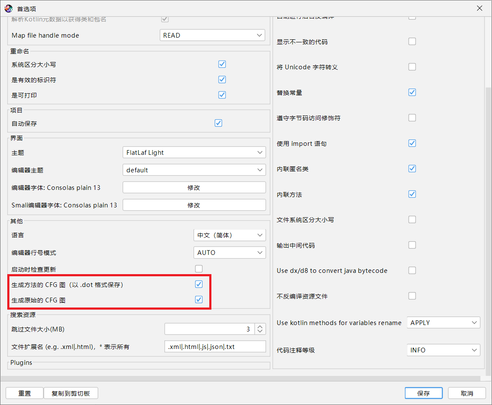
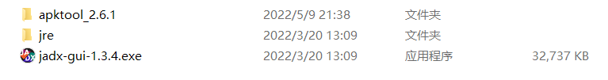
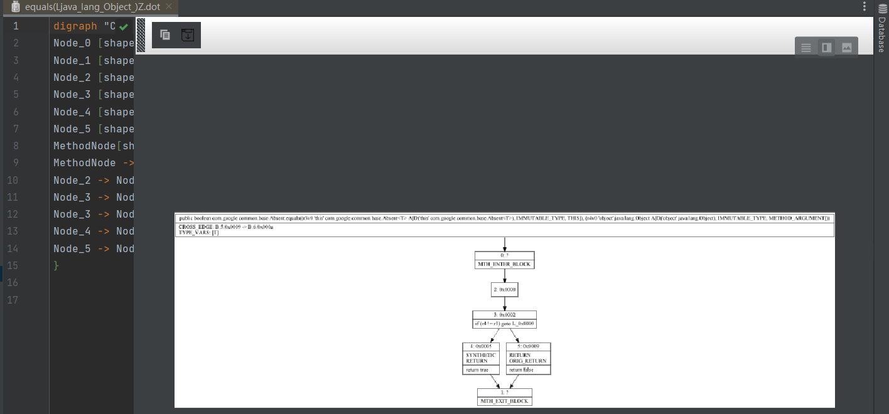
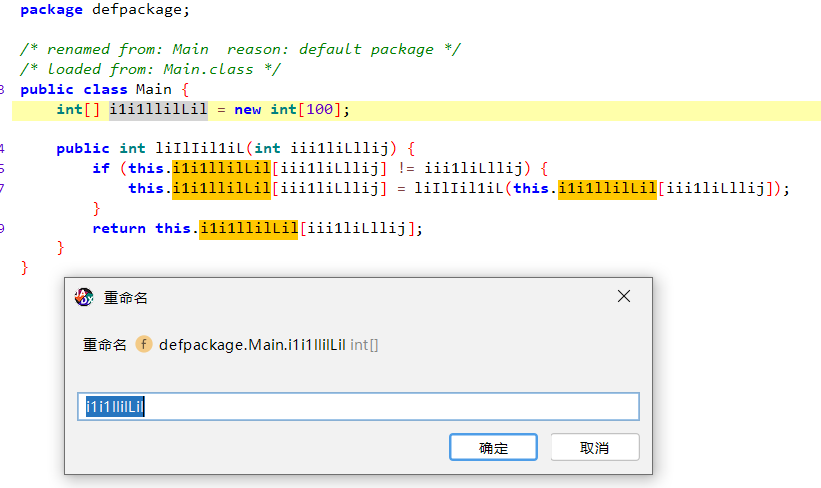
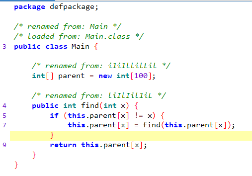
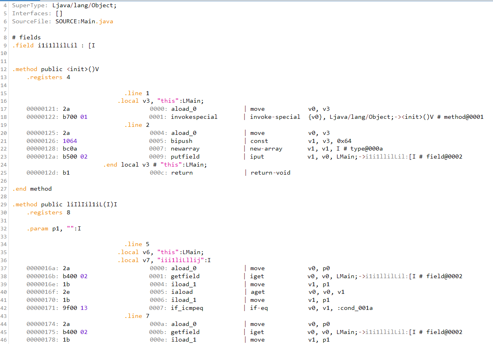
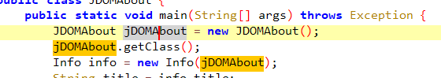

## jadx的实用功能

jadx作为一款强大的Java反编译器，加上其开源且免费的特性，深受广大逆向人员的喜爱，它也是笔者最喜欢使用的反编译器。它提供的众多辅助功能中有4个实用功能笔者想要介绍给大家，希望能对逆向工作有所帮助。同时，结合本教程所涉及的内容，这些功能简直可以说非常贴近本教程了。

本篇使用的程序版本为[1.3.4的GUI版](https://github.com/skylot/jadx/releases/download/v1.3.4/jadx-gui-1.3.4-with-jre-win.zip)。

想了解更多的功能，可查看其[Wiki](https://github.com/skylot/jadx/wiki)。

#### 本篇目的：
* 介绍“控制流图绘制”功能
* 介绍“标识符重命名”功能
* 介绍“ASM代码查看”功能
* 介绍“单击复制”功能

### 一、控制流图绘制

?> **提示** 关于控制流图及其分析本教程将在第四部分第而节进行详细阐述。

**控制流图(Control Flow Graph, CFG)** 也叫控制流程图，是一种抽象的有向图，该图表示了一段程序所有可能的执行路径，并将其按照执行的先后顺序用有向边连接起来。在反编译器中，构建控制流图、并根据其结构推测所属的语句是反编译器实现的核心原理之一。

不过，由于在保证等价性的前提下，改变控制流的方式客观存在，所以一旦控制流图的结构不良导致反编译器无法正确推断出结构代码，就会**反编译失败**。这时，一般就需要通过绘制控制流图的方式来查看程序到底是怎么工作的了。

绘制方法：

Step1: 打开软件，点击“文件”——“首选项”——找到“其他”部分——勾选“生成方法的 CFG 图（以.dot格式保存）”（生成原始CFG图也可勾选上）

然后反编译任意Java程序，在点击任意一个类后，该类下所有方法的控制流图就会生成在jadx所在目录下。

查看.dot文件对应的图可以使用[GraphViz工具](https://graphviz.org/)，但如果你有IntelliJ IDEA的话，可以直接使用它打开.dot文件后安装扩展来显示图片。

### 二、标识符重命名

?> **提示** 关于混淆与反混淆本教程将在第四部分第一节进行详细阐述。

在推断出一个标识符的含义后，可以单击标识符，按`N`直接修改标识符的名字，它的引用也全部随之变化，非常省事：

修改前

修改后

### 三、字节码指令查看

?> **提示** 关于Java的字节码指令的介绍，本教程将在第二部分进行详细阐述。

在代码页面，按`Tab`键或者点击下方的**Smali**，可以查看字节码文件的指令：

需要注意的是，对于部分指令，`|`左边的是Java字节码指令，右边的是其等价的smali指令。通常情况下只需要看左边的即可，右边的可进行语义上的参考。

### 四、单击复制

在jadx中，可以单击标识符的名字，然后直接按`Ctrl + C`组合键复制标识符名，不需要双击或拖拽选中了：

本篇参考资料：
1. jadx: https://github.com/skylot/jadx/
2. jadx Wiki: https://github.com/skylot/jadx/wiki