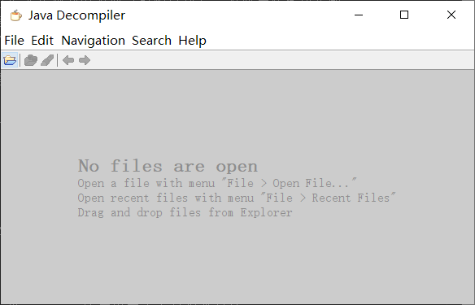
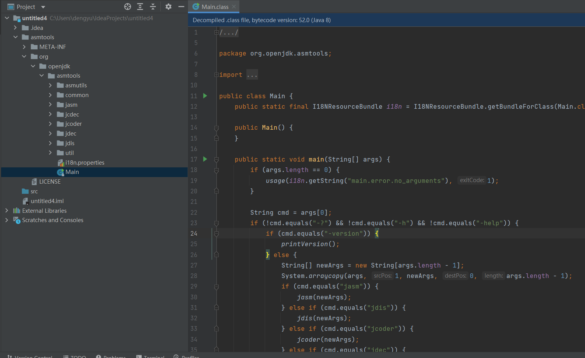
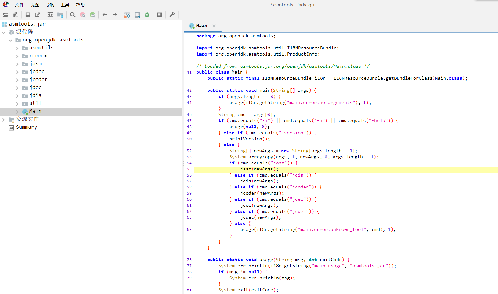
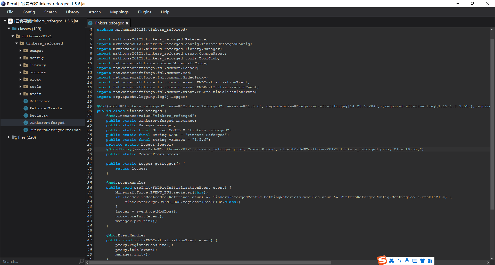

## 反编译器介绍
反编译器是逆向人员的最重要的朋友之一。对于Java的反编译器来说，它能将字节码文件直接反编译为高级代码，使得程序的运行机制一览无余。Java的反编译器种类多种多样。本文将介绍三种反编译器：

#### Jd-gui

对于长期处于一线的反后门人员来说，Jd-gui的使用是很常见的。

jd-gui

使用起来很简单：只需要把需要反编译的文件拖拽到它的窗口内就行了。

#### IDEA-Decompiler

对于使用IntelliJ IDEA的开发者，你的IDEA就可以是一个反编译器！

打开任意一个工程，把**解压后的**jar的文件夹内容复制到该工程范围下，就可以直接点击.class文件读源代码了。

IDEA反编译

#### jadx

Jadx是一个功能强大的、实用的、免费的反编译器。它甚至支持反编译apk文件，且它反编译效率高、反编译出来的代码质量好。

#### Recaf

Recaf是一款功能**异常强大**的反编译器。它除了能反编译代码外，还支持运用混淆映射表反混淆代码和动态修改字节码的功能。动态修改字节码的功能将在第三部分介绍。

!> **注意货比三家!** 反编译器种类繁多、反编译出来的代码质量、可读性等都存在差异。**没有一款绝对最强的反编译器**。因此，注意货比三家，使用不同的反编译器来反编译代码，是逆向工程中的黄金法则。

### 习题一：

[下载习题文件](https://github.com/ABlueCat123/REtutorial/blob/main/Practice/Lesson1_3)

!> **提醒** 在获得习题文件时请**谨慎**对比习题文件信息，以免收到不受信任的文件。

习题文件信息：

包含 1 个文件:
- Lesson1_3.zip

Lesson1_3.zip信息:

`SHA256: 2080957049b74f7f6bb10ec904c5a302cf63433dbfb5b61a10ff6d78142caf97`
`MD5: fe404bf0789966f42f1a8c07f9c35d36`

任务：
* 解压缩文件`Lesson1_3.zip`，得到`Lesson1_3.jar`和文件夹`Lesson1_3`；
* 反编译插件`Lesson1_3.jar`，并大致理解该插件的含义；
* 使用IntelliJ IDEA打开该插件的工程项目文件`Lesson1_3`，根据反编译结果完成工程文件中**缺失**的部分，并**构建**它。

### *习题二：

任务：
* 使用**至少三种**不同的反编译器反编译任意一份jar包(jar包可以在mc的目录下轻易找到)，对比反编译的代码质量。

4. jd-gui: https://github.com/java-decompiler/jd-gui
5. IntelliJ IDEA官网: https://www.jetbrains.com/idea/
6. jadx: https://github.com/skylot/jadx/