## 控制流图分析
**控制流(Control Flow)** 指的是在程序运行过程中各指令执行的顺序。由于控制流具有有向性和有穷性的特点，故可以将控制流抽象出来，构建出 **控制流图(Control Flow Graph)** 。

控制流图及其应用在反编译器的工作中起到了很大作用，因为对于局部的程序来说，推断出代码结构的有效依靠就是控制流图的结构。

然而，正如第一二节已经指出的，在保证程序等价性的前提下，改变控制流的方式客观存在，所以一旦控制流图的结构不良就会导致反编译器无法正确推断出结构代码。因此，学会控制流分析，是逆向人员的必修课。

不过值得指出，考虑到理论性和实践性的结合和本教程的实际，本教程力求于使用简洁、干练的语言讲解本部分，因此深度可能有所缺乏。若需要更深层次的学习，请参照《编译原理》相关章节。同时，传统的控制流分析也有其局限性，一个方面是它一般基于3个不安全的假设：(1)假设函数调用引用的地址都在有效代码序列中。(2)假设只有控制转移指令才会引起控制流的转移。(3)假设条件分析的目标都包含有效代码且可以执行。<sup>[1]</sup>因此，对

#### 本篇目的：
* 控制流图的绘制
* 常见的控制流图
* 对不良形态控制流图进行分析

### 一、控制流图的绘制

首先，我们知道了控制流图本质上是一个有向图，而有向图的**节点**我们称之为**基本块(Basic Blocks)** 。基本块本质上是一个指令集，控制流在基本块内部**顺序执行**。因此，每个基本块需要满足：
1. 控制流只能从该基本块的第一条语句进入。也就是说，不可能通过跳转语句跳转进基本块中间的任何一条语句。(如果发生了，证明它不是个基本块，请把这段代码按被跳转位置分成两块)
2. 除了该基本块的最后一个指令外，控制流在离开基本块之前不进行跳转。
3. 极大性。即如果往一个指令块里面添加任意一条指令，得到的指令块仍然满足1 2两条性质，该指令块就不是一个基本块。

?> **小测试** 给以下代码划分基本块：

```java
    a += 2;
    b *= 3;
    int c = a + b;
    if (c > 0)
    {
        a = 1;
        b = 0;
    }
    else
    {
        a = 0;
        b = 1;
    }
```

参考答案:

有3个基本块：
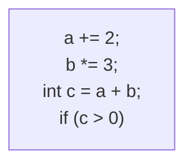

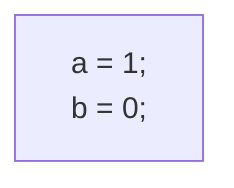

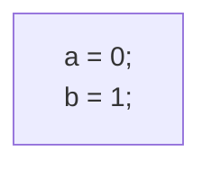

!> **注意** 或许你看到了，第一个基本块最后一句是if语句，因为上文定义了“除了该基本块的最后一个指令外，控制流在离开基本块之前不进行跳转”，因此if语句属于第一个基本块，且离开是通过跳转实现的。

而

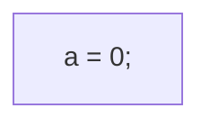

明显不是基本块，因为它可以继续延拓至两个语句。

在我们了解控制流图的节点之后，接下来就了解什么是控制流的**有向边**了。对于控制流，其边是通过**跳转**实现的，而跳转分为条件跳转和无条件跳转两种。从跳转起点指向跳转终点。条件跳转需要标明跳转条件，且相同路径只能有一条控制流路径。
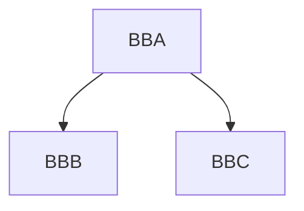
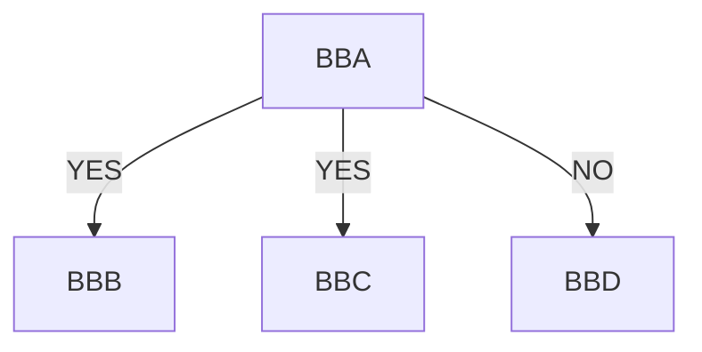

以上都不是合法的控制流图，因为相同路径中出现了多条控制流路径。

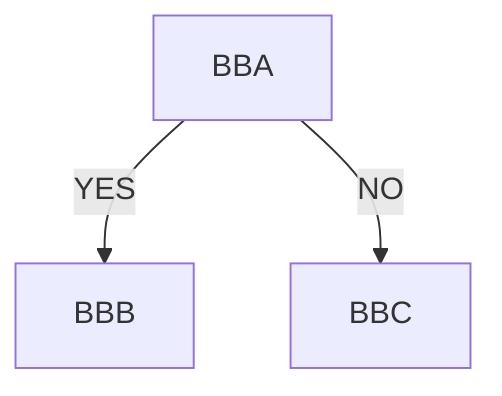

以上是合法的控制流图。当然，如果基本块BBA只有一条判断语句，还可以按照约定把它直接画成菱形。

最后，对于每个控制流，都有**唯一**的入口和**唯一**的出口。入口通常指程序运行入口、函数调用入口等等；出口通常指程序结束出口或函数完毕出口等等。不过允许从入口进入控制流之后分成若干分支，也允许从不同分支汇往该出口。

因此，上文所述代码的最终的控制流图如下：
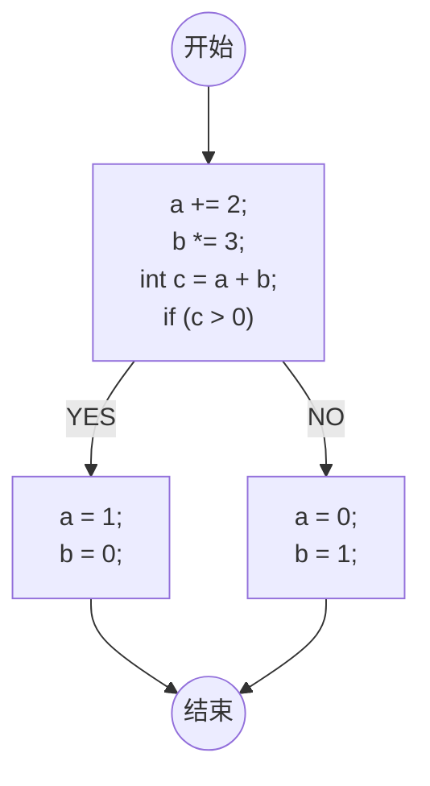

?> **提示** 可能你在一个函数里面写过多个return; 语句，但在控制流图分析里面，需要将其理解为不同的return语句都无条件地跳转到了一个最终的返回语句。此外，在**没有歧义**的前提下，可以省略开始点和结束点。

### 二、常见的控制流图
对于一些较为常见的代码，它有着比较清晰的控制流图：
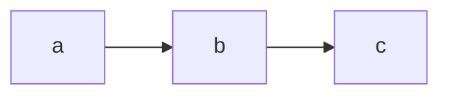
此为**顺序结构**。

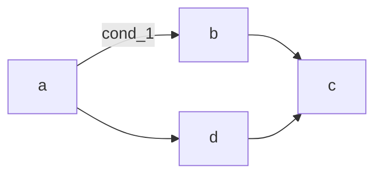
此为**选择结构**，这里的`cond_1`指的是达成`cond_1`的条件后跳转至b，否则跳转至d。

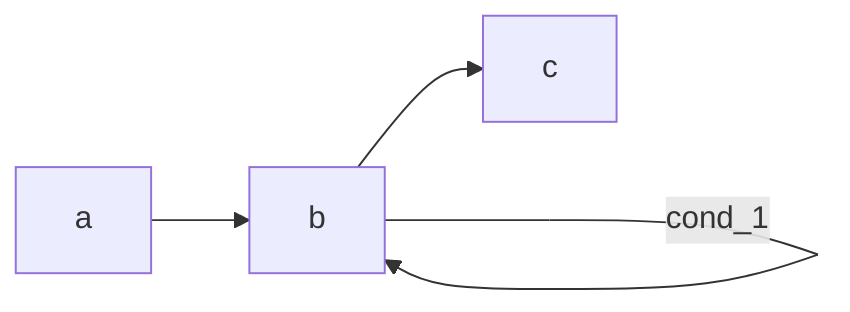
此为**do-while语句的结构**。

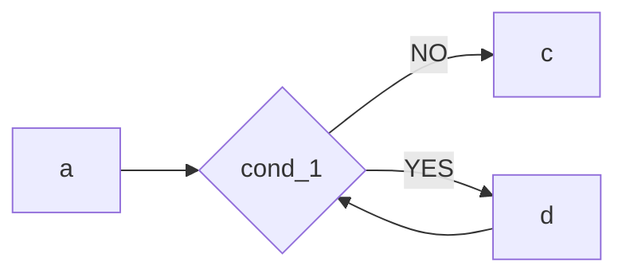
此为**while语句的结构**。

实际上，当代码是高级语言形式时，画出其对应的控制流图是十分容易的。控制流图分析更多是应用在字节码层面上，当它从字节码转为高级代码时，就需要通过常见的控制流图的结构来推出了。

### 
本篇参考资料：
1. 刘建林,王震宇,蒋烈辉,等. 基于控制流分析的隐藏代码动态捕获方法[J]. 计算机工程,2011,37(21):23-25. DOI:10.3969/j.issn.1000-3428.2011.21.008.
2. 《编译原理 第二版》