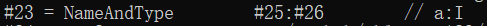
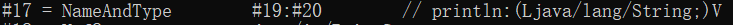
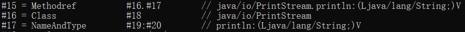
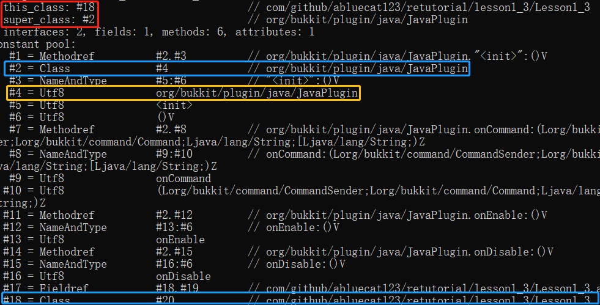
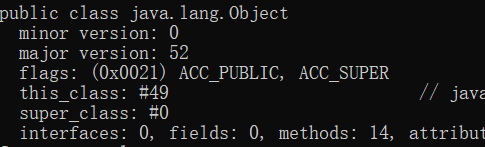
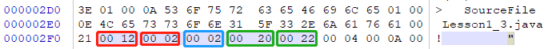
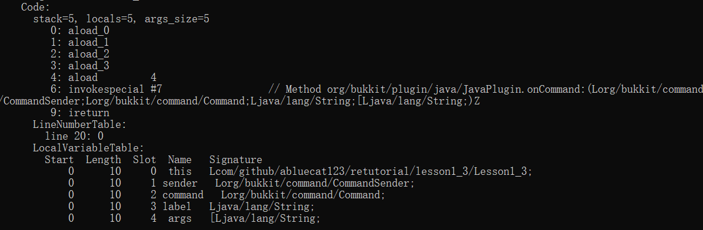

## .class文件介绍
字节码文件是应用Java逆向工程的基础文件。对于逆向人员以及部分开发者来说，了解其文件结构是十分重要的事情。在[JVM规范](https://docs.oracle.com/javase/specs/jvms/se18/html/jvms-4.html#jvms-4.1)中已经给出了其结构，现本节将对此进行介绍。

#### 本篇目的：
* 熟练掌握.class文件的结构

### 一、javap 命令

javap是java自带的class文件分解器。利用这个命令可以十分方便地分析字节码文件。

打开命令提示符，输入`javap`命令，输出帮助页面：
```
用法: javap <options> <classes>
其中, 可能的选项包括:
  --help -help -h -?               输出此帮助消息
  -version                         版本信息
  -v  -verbose                     输出附加信息
  -l                               输出行号和本地变量表
  -public                          仅显示公共类和成员
  -protected                       显示受保护的/公共类和成员
  -package                         显示程序包/受保护的/公共类
                                   和成员 (默认)
  -p  -private                     显示所有类和成员
  -c                               对代码进行反汇编
  -s                               输出内部类型签名
  -sysinfo                         显示正在处理的类的
                                   系统信息（路径、大小、日期、SHA-256 散列）
  -constants                       显示最终常量
  --module <模块>, -m <模块>       指定包含要反汇编的类的模块
  -J<vm-option>                    指定 VM 选项
  --module-path <路径>             指定查找应用程序模块的位置
  --system <jdk>                   指定查找系统模块的位置
  --class-path <路径>              指定查找用户类文件的位置
  -classpath <路径>                指定查找用户类文件的位置
  -cp <路径>                       指定查找用户类文件的位置
  -bootclasspath <路径>            覆盖引导类文件的位置
  --multi-release <version>        指定要在多发行版 JAR 文件中使用的版本
```

在逆向分析中，比较感兴趣的是`-v -p`两个选项。-v可以输出行号、局部变量表信息、常量池等信息，顺带还可以输出方法体内的字节码指令（包含-c选项内容）；-p可以显示所有类和成员（即没有加这个选项默认不输出private的方法和属性）。

### 二、“魔数”和class文件的版本号

使用一款十六进制编辑器打开任意一个字节码文件(教程此处使用的是[WinHex](http://www.x-ways.net/winhex/))


<center><font size="2" color="grey">图1 魔数和版本号介绍</font></center>

注意到前8个字节(<font color="red">红框</font>框起来的部分)，第1~4个字节(0xCAFEBABE)是一个常数，它叫做**魔数**(Magic Number)。魔数的唯一作用是供Java虚拟机在**验证**阶段识别此文件是否为合法的字节码文件。至于为什么是0xCAFEBABE，其中的缘由耐人寻味<sup>[注1]</sup>。不过实际上，有许多文件都会以一段特定的数据开头，作为识别是否为该类型文件的证据之一。例如.zip文件就必定以PK(该格式的发明者Phil Katz的名字缩写)开头。[这里](https://blog.csdn.net/ChaoYue_miku/article/details/112507244)介绍了许多常见文件的文件头。

接下来的4个字节分别代表**次版本号**和**主版本号**。版本号和编译使用的JDK版本有关，JDK版本号和Class版本号的关系可见[此处](https://docs.oracle.com/javase/specs/jvms/se18/html/jvms-4.html#jvms-4.1)。在**验证**阶段，若Class版本号并不在JDK的支持范围内，即Class版本号高于JDK能编译出来的版本的话，将会报出`java.lang.UnsupportedClassVersionError`错误。

值得注意的是，版本号以及接下来所需要介绍的内容都可以通过命令`javap -p -v <filename>.class`直接查看，而不需要继续使用十六进制编辑器查看了。

### 三、常量池
常量池是class文件中各种常量的存放地。class文件接下来的两个字节(<font color="blue">蓝框</font>框起来的部分)是**常量池计数器**，代表常量池中常量的个数 + 1。(常量池的计数是从1开始的)。如图所示为0x0053，即为十进制数83，代表常量池中一共有82个常量(标号为1~82)。实际上，0号常量可理解为一个占位符，表示“不引用任何一个常量池常量”，下文看`java.lang.Object`类的父类时可以看见0号常量的用法。

[Java虚拟机规范官方文档的第4.4节](https://docs.oracle.com/javase/specs/jvms/se18/html/jvms-4.html#jvms-4.4)介绍了目前(Java 18)完整的常量类型(共17种)，接下来将介绍一些相对重要的常量。其他的常量介绍还请看官方文档。

?> **提示** 建议读者认真阅读官方文档，即使文档本身是使用英文写成的。阅读它们可以使得对Java的理解更加深刻。

对于任意一个常量来说，其第一位一定是tag(tag指的是常量类别，根据tag可确认该常量的类型)。为节省篇幅，加之其在`javap`的常量池中并不会出现，故隐去。

#### 3.1 Utf8型常量(`CONSTANT_Utf8`型)
这个常量存储两个数据，第一个数据为常数，代表接下来的字符串的长度；第二个数据为一个UTF-8编码的字符串。

该常量是其他类型常量构造的基础。

#### 3.2 Class型常量(`CONSTANT_Class`型)
这个常量有一个数据，该数据是一个`CONSTANT_Utf8`类型的常量，为该字符串代表的类。


<center><font size="2" color="grey">图3.2 Class型常量</font></center>
上图中常量16便是一个代表`java.io.PrintStream`类的常量

#### 3.3 String型常量(`CONSTANT_String`型)
这个常量有一个数据，该数据是一个`CONSTANT_Utf8`类型的常量，为该字符串代表的字符串。

#### 3.4 NameAndType型常量(`CONSTANT_NameAndType`型)
这个常量有两个数据，都是`CONSTANT_Utf8`型数据，分别代表了字段或方法的名字和描述符。对于NameAndType型常量的介绍和作用，将在下一节讲解。


<center><font size="2" color="grey">图3.4.1 字段的NAT常量</font></center>


<center><font size="2" color="grey">图3.4.2 方法的NAT常量</font></center>

#### 3.5 Fieldref、Methodref、InterfaceMethodref型常量
这些常量都是**符号引用**。它们由两个数据组成，一个是`CONSTANT_Class`型，另一个是`CONSTANT_NameAndType`型。把这两个数据组合之后即成为符号引用常量。

<center><font size="2" color="grey">图3.5 符号引用常量</font></center>

### 四、访问标志
常量池之后紧接着是**访问标志**。访问标志描述了这个类或者接口的一些访问信息，如字节码文件的类型(是类、接口、注解亦或是枚举类型)、修饰符等。它占有2个字节，共16个bit。可以从下表中看出，**任意一个访问标志的值都只占有<mark>一个</mark>二进制位**，生效则为1，无效则为0。有意义的符号位只有9个，其他皆应该置为0。

访问标志表如下：

| 访问标志      |  值     | 描述 |
|:-------------:|:------:|:-----------:|
| ACC_PUBLIC    | 0x0001 | 声明为`public`  |
| ACC_FINAL     | 0x0010 | 声明为`final`   |
| ACC_SUPER     | 0x0020 | 见下  |
| ACC_INTERFACE | 0x0200 | 声明此为一个接口，而非一个类 |
| ACC_ABSTRACT 	| 0x0400 | 声明此为抽象类 |
| ACC_SYNTHETIC | 0x1000 | 声明此为一个合成类(这个属性不会在源码体现) |
| ACC_ANNOTATION| 0x2000 | 声明此为一个注解 |
| ACC_ENUM 	    | 0x4000 | 声明此为一个枚举类型 |
| ACC_MODULE    | 0x8000 | 声明此为一个模块 |

使用`javap`命令可以看到字节码文件的访问标志。唯一需要注意的是`ACC_SUPER`标志，由于`invokespecial`指令语义在JDK 1.0.2发生过改变，为区分使用新语义或旧语义，添加了此标志。可以认为，在新版的JDK中，**此条标志必定为真**。

对于所有为真的访问标志，应按照按位或的方式连接起来。例如，对于`public final class A{}`，其访问标志为`ACC_PUBLIC | ACC_FINAL | ACC_SUPER`=`00110001` $_{2}$。

### 五、类索引、父类索引、接口索引集合
类索引、父类索引的内容皆为一个常量池中的`CONSTANT_Class`型常量，用于确定类的本身和父类的全限定名。通过一个全限定名可以唯一确定一个类。下图展示了类索引和父类索引：

<center><font size="2" color="grey">图4.1 类索引、父类索引及部分常量池</font></center>

值得注意的是，任何类的父类都是`java.lang.Object`类或其子类，而对于`java.lang.Object`类，其父类索引为0号常量：

<center><font size="2" color="grey">图4.2 Object类的父类索引</font></center>

接下来是接口索引集合。接下来的两个字节为接口索引计数值，表示该类实现的接口数目。这个计数值从0开始计数。若不为0，则接下来的`计数值`个字节为常量池中`CONSTANT_Class`型常量。

<center><font size="2" color="grey">图4.3 十六进制编辑器下的三类索引</font></center>

上图自`!`结束常量池之后，第一个<font color="red">红框</font>标识的为类索引、父类索引，指向0x12=#18、0x02=#2号常量池常量，也就是图4.1所示的#18号和#2号。

接下来<font color="blue">蓝框</font>内部的是接口索引计数值，在接下来<font color="green">绿框</font>两字节是接口的常量值。

### 六、字段表集合、方法表集合、属性表集合
本文最后一部分将一同介绍以上三种集合。这些集合都由以下组成：
* 集合计数值。即每个集合的元素的计数值。
* 访问标志。与类的访问标志类似，字段/方法 也有对应的访问标志。
* 名称索引。这个包含一个指向常量池`CONSTANT_Utf8`的常量，为其简单名称。
* 描述符。这个包含一个指向常量池`CONSTANT_Utf8`的常量，为其描述符。描述符将在下一节介绍。
* 属性表计数器与`计数器`个属性表。

#### 6.1 属性表
属性表可以描述一些场景的专有信息。这些专有信息可在.class文件本身、字段表、方法表乃至于一些属性本身（见下方的`Code`属性）中出现。

?> 什么是专有的信息？例如，对方法、属性、类来说，只要打上了`@Deprecated`注解，其属性表中就会出现`Deprecated`属性。除此之外，方法所抛出的异常列表，也就是`throws`关键字后面跟随的一切异常、对类文件标识的`SourceFile`属性等等……这些都在属性表中出现。  
而且，属性表甚至可以出现在属性表中，作为属性的子属性。对于`Code`属性，其有三个子属性：`LineNumberTable`（行号与字节码指令对应表）、`LocalVariableTable`（局部变量表）、`StackMapTable`（检查目标方法的局部变量与操作数栈所需要的类型是否匹配）  
属性表的应用十分灵活。在本教程中，除`Code`属性外，我们不关心其他属性，因为这不是我们的目标。



上图展示了方法`onCommand`的属性表。值得注意的是，只有方法表的属性表中有`Code`属性。`Code`属性包含了描述其方法内容的字节码指令，是class文件中最重要的属性。`Code`属性的进一步介绍将在第三节完成。由于完整的属性类型及适用范围网络上均有介绍，故本文将不再重复叙述。[官方文档](https://docs.oracle.com/javase/specs/jvms/se18/html/jvms-4.html#jvms-4.7) [中文介绍](https://blog.csdn.net/cz2423415723/article/details/125088591)


### 习题：
[下载习题文件](https://github.com/ABlueCat123/REtutorial/blob/main/Practice/Lesson2_1)

!> **提醒** 在获得习题文件时请**谨慎**对比习题文件信息，以免收到不受信任的文件。

习题文件信息：

包含 1 个文件:
- Lesson2_1.zip

Lesson2_1.zip信息:

`SHA256: ee74da569e2f8dbae41f0a57297fa0ee1857680690595e4144b7a43dba32b1e9`
`MD5: 9a634b790c4c1d9d69830b88b8c386f9`

任务：
* 解压`Lesson2_1.zip`。使用任意一款十六进制编辑器打开4个字节码文件，找到正文中介绍的**所有**字节码文件组成部分。并使用`javap`指令来输出其相关信息并对比你所找到的信息与其是否一致。
* 使用`java`命令运行`Main.class`，观察其输出结果。并尝试利用编辑器修改魔数、class文件版本号、常量池等信息，再运行一次试试。
* 对比`Main.java`和内部类字节码，思考`Main$1.class`的产生原理。

本篇参考资料：
1. 《深入理解JAVA虚拟机：JVM高级特性与最佳实践（第3版）》 周志明著
2. The Java Virtual Machine Specification. Tim Lindholm.等 https://docs.oracle.com/javase/specs/jvms/se18/html/index.html

注释：
1. 据说(参见《深入理解JAVA虚拟机》一书)，这个魔数象征着著名咖啡品牌Peet's Coffee。并且之后可能和Java的商标咖啡有关系。