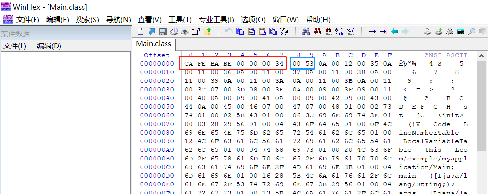

## .class文件介绍
字节码文件是应用Java逆向工程的基础文件。对于逆向人员以及部分开发者来说，了解其文件结构是十分重要的事情。在[JVM规范](https://docs.oracle.com/javase/specs/jvms/se18/html/jvms-4.html#jvms-4.1)中已经给出了其结构，现本节将对此进行介绍。

#### 本篇目的：
* 熟练掌握.class文件的结构

### 一、“魔数”和class文件的版本号

使用一款十六进制编辑器打开任意一个字节码文件(教程此处使用的是[WinHex](http://www.x-ways.net/winhex/))

注意到前8个字节(红框框起来的部分)，第1~4个字节(0xCAFEBABE)是一个常数，它叫做**魔数**(Magic Number)。魔数的唯一作用是供Java虚拟机在**验证**阶段识别此文件是否为合法的字节码文件。至于为什么是0xCAFEBABE，其中的缘由耐人寻味[注1]。不过实际上，有许多文件都会以一段特定的数据开头，作为识别是否为该类型文件的证据之一。例如.zip文件就必定以PK(该格式的发明者Phil Katz的名字缩写)开头。[这里](https://blog.csdn.net/ChaoYue_miku/article/details/112507244)介绍了许多常见文件的文件头。

接下来的4个字节分别代表**次版本号**和**主版本号**。版本号和编译使用的JDK版本有关，JDK版本号和Class版本号的关系可见[此处](https://docs.oracle.com/javase/specs/jvms/se18/html/jvms-4.html#jvms-4.1)。在**验证**阶段，若Class版本号并不在JDK的支持范围内，即Class版本号高于JDK能编译出来的版本的话，将会报出`java.lang.UnsupportedClassVersionError`错误。

值得注意的是，版本号以及接下来所需要介绍的内容都可以通过命令`javap -v -c <filename>.class`直接查看，而不需要继续使用十六进制编辑器查看了。

### 二、常量池
常量池是class文件中各种常量的存放地。class文件接下来的两个字节(蓝框框起来的部分)是**常量池计数器**，代表常量池中常量的个数 + 1。(常量池的计数是从1开始的)。如图所示为0x0053，即为十进制数83，代表常量池中一共有82个常量(标号为1~82)。

[Java虚拟机规范官方文档的第4.4节](https://docs.oracle.com/javase/specs/jvms/se18/html/jvms-4.html#jvms-4.4)介绍了目前(Java 18)完整的常量类型(共17种)，接下来将介绍一些相对重要的常量。其他的常量介绍还请看官方文档。

?> **提示** 建议读者认真阅读官方文档，即使文档本身是使用英文写成的。阅读它们可以使得对Java的理解更加深刻。

对于任意一个常量来说，其第一位一定是tag(tag指的是常量类别，根据tag可确认该常量的类型)。为节省篇幅，加之其在`javap`的常量池中并不会出现，故隐去。

#### 2.3 Utf8型常量(`CONSTANT_Utf8`型)
这个常量存储两个数据，第一个数据为常数，代表接下来的字符串的长度；第二个数据为一个UTF-8编码的字符串。

该常量是其他类型常量构造的基础。

#### 2.2 Class型常量(`CONSTANT_Class`型)
这个常量有一个数据，该数据是一个`CONSTANT_Utf8`类型的常量，为该字符串代表的类。

上图中常量16便是一个代表`java.io.PrintStream`类的常量

#### 2.3 String型常量(`CONSTANT_String`型)
这个常量有一个数据，该数据是一个`CONSTANT_Utf8`类型的常量，为该字符串代表的字符串。

#### 2.4 NameAndType型常量(`CONSTANT_NameAndType`型)
这个常量有两个数据，都是`CONSTANT_Utf8`型数据，分别代表了字段或方法的名字和描述符。对于描述符的介绍，将在第六节讲解。

字段的NAT常量

方法的NAT常量

#### 2.5 Fieldref、Methodref、InterfaceMethodref型常量
这些常量都是**符号引用**。它们由两个数据组成，一个是`CONSTANT_Class`型，另一个是`CONSTANT_NameAndType`型。把这两个数据组合之后即成为符号引用常量。

### 习题：
1. 思考通过javac编译获得的字节码文件相对于使用gcc/g++等编译器编译得到的汇编代码有什么特点？
2. 思考JVM在整个执行周期中，是如何确保字节码程序能安全稳定地运行的？
3. 阅读参考资料中相关文献，对JVM的结构进行进一步认识。

本篇参考资料：
1. 《深入理解JAVA虚拟机：JVM高级特性与最佳实践（第3版）》 周志明著
2. The Java Virtual Machine Specification. Tim Lindholm.等 https://docs.oracle.com/javase/specs/jvms/se18/html/index.html

注释：
1. 据说(参见《深入理解JAVA虚拟机》一书)，这个魔数象征着著名咖啡品牌Peet's Coffee。并且之后可能和Java的商标咖啡有关系。