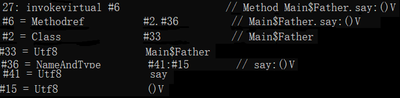

## 描述符
在JVM层面，描述一个方法或字段的**类型**并不是采用我们常见的格式，而是采用一个名为 **描述符(Descriptor)** 的字符串来表示。描述符在常量池中使用一个Utf8型常量来表示。本节的目的便是介绍描述符、NameAndType型数据的作用。本节还将介绍方法签名的作用及与方法的NameAndType数据的区别。

#### 本篇目的：
* 了解类型描述符的定义、作用，并能进行类型定义和描述符的互转
* 了解NameAndType型常量的构造及作用
* 了解什么是方法签名

### 一、类型描述符
对于描述符来说，它描述一个类型并不是按定义那样使用完整的类型定义的关键字来描述，而是使用特有的语法来定义：

| 类型描述关键字 | 语法定义 |
|:----------:|:------------:|
| byte       | B            |
|boolean | Z            |
| char       | C            |
| double     | D            |
| float      | F            |
| int        | I            |
| long       | J            |
| short      | S            |
| void       | V            |
| 任意类型       | LClassName;            |
| 一维数组[]       | [            |
| 多维数组[][]…     | [[…            |

不难发现，除了boolean -> Z, long -> J外，其他的类型语法定义就是其类型描述关键字的首字母大写。对于任意其他类型，语法为`L` + 类型完整位置 + `;`。包名之间用`/`隔开。例如若在com.github.abluecat123.retutorial.lesson2_2包下有一个名为Main的类，则其语法定义为`Lcom/github/abluecat123/retutorial/lesson2_2/Main;`。注意起始的`L`和末尾的`;`不能漏。

对于数组的定义，是**左方括号在前，紧跟着类型的语法定义**。如int [][]对应着 `[[I`，String[] 对应着`[Ljava/lang/String;`

类型描述符可分为**字段描述符**和**方法描述符**两类。对于一个字段的描述符，就是其类型按上文规则变换即可。而方法的描述符要稍微复杂一点点，其格式为：

`(参数1类型参数2类型…参数n类型)返回值类型`

值得指出，上面的参数1类型~参数n2类型以及返回值的类型都是严格按照上述语法定义来的，**没有任何分割符和结束符**。当看到`;`时，则一定是与任意类型描述符`L`配套使用的，而非语法规定。

例如：方法`Object m(int i, double d, Thread t) {...}`的方法描述符为：

`(IDLjava/lang/Thread;)Ljava/lang/Object;`

### 二、NameAndType型常量
在第一节中介绍了类型描述符，但需要注意，类型描述符内并不包含字段或者方法的名字。也因此需要一个常量同时包含名字和类型，以供代码唯一确定引用对象。NameAndType型常量便是用来完成这个工作的。

上一节已经提到，该常量由两个`CONSTANT_Utf8`型数据构成，而它们分别代表了字段或方法的名字和其描述符。在利用`javap`指令查看常量池的时候可以看到其组成为`#常量1:#常量2`。

NameAndType型常量往上可以进一步构成**符号引用常量**。上一节已经提到，符号引用常量由Class型常量和NameAndType型常量构成。符号引用常量在`javap`指令查看时的格式为`#常量1.#常量2`符号引用常量是最终供给部分字节码指令使用。下图是`invokevirtual`指令调用`say()`函数所引用的全部常量，这个引用关系可构建为一棵树，读者可尝试自行画出这棵树。

### 习题：
写出以下字段定义或方法定义的**描述符**。
1. `boolean[][]`
2. `String[]`
3. `boolean check(long num, String str, double fix)`
4. `void a(int b, int[] c, int[][] d)`

判断以下**描述符**是否正确？若正确请转化为字段定义或方法定义的形式：
1. `Ljava/lang/String;[[`
2. `method(Lcom/example/L1;IZ)V`
3. `[[java.lang.Thread(I;J;[Z)`
4. `(Ljava/lang/Object;I[B[[Z)Lcom/a/b/C;`
5. `void m(int a, long b, String c)`
6. `[Ljava/lang/String`
