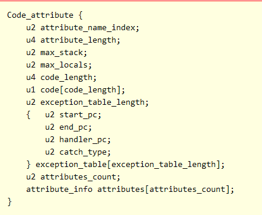
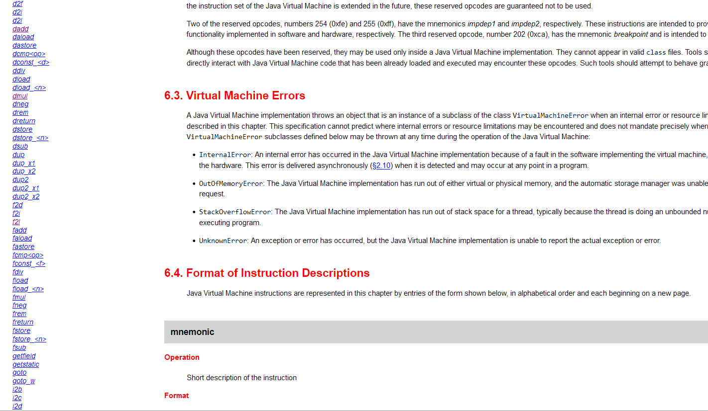

## 字节码指令介绍（一）
从本节开始将介绍字节码指令。这一部分十分重要，是第三部分的核心基础。本文将分三节介绍它。每一节将讲解：
* 数据转储指令、运算指令、类型转换指令、返回指令
* 控制转移指令、方法调用指令
* 对象操作指令、操作数栈操作指令

#### 本篇目的：
* 了解Java执行过程中的操作数栈执行原理
* 了解什么是字节码指令
* 了解数据转储指令、运算指令、返回指令

### 一、再谈操作数栈、局部变量表和常量池
在第一部分第一节里面，我们很粗略地提到了操作数栈、局部变量表和常量池三个概念。这三个概念有着很紧密的联系。 **Java语言的一切工作都是建立在操作数栈上面的。**

我们先引入**后缀表达式**的概念。后缀表达式，又称逆波兰表达式，指的是不包含括号、运算符放在两个运算对象的后面，所有的计算按运算符出现的顺序严格从左向右进行的一种表达式。这种表达式是通过栈来工作的。

譬如，对于常规表达式 $(2+5^3) \times 4 + 3$ ，我们先看其写成后缀表达式的形式：

`5 3 ^ 2 + 4 * 3 +` （其中^代表乘方运算）

后缀表达式在计算时严格地从左到右计算。一旦遇到**数字**就压入栈内，遇到**运算符**就弹出需要的栈顶元素，进行计算后放回。

?> **提示** 对于符合交换律的运算，如加法，那么`3 4 +`与`4 3 +`是等效的；然而，对于不满足的交换律的运算，我们约定：**被操作数**为栈的**次顶**元素，而**操作数**为**栈顶**元素。即对于减法表达式$4 - 3$来说，其后缀表达式为`4 3 -`，减数3为栈顶元素，而被减数4为次顶。对于除法同理，被除数为次顶元素，而除数为栈顶元素。  
虚拟机指令中没有乘方运算，但下面演示时，底数为被操作数，而指数为操作数。请大家一定要注意次序。  
Java虚拟机执行运算指令时，上述法则仍然有效。

对于常规表达式来说，我们是先计算$5^3$，然后与2相加，接着乘以4后再加3。

而后缀表达式的计算过程如下：（按照上述约定，在写栈顶两个值时，为便于理解，就把被操作数（次顶元素）写左边，操作数（栈顶元素）写右边，但请注意顶和底的数字到底是什么）
1. 先在栈内压入 5 ，此时栈的结构为 `栈底 | 5 | 栈顶`；
2. 再向栈内压入 3 ，此时栈的结构为 `栈底 | 5 | 3 | 栈顶`；
3. 通过 ^ 运算，弹出栈顶两个值（5 3），计算$5^3$，得到125后压入栈内，此时栈的结构为 `栈底 | 125 | 栈顶`；
4. 将2压入栈内，此时栈的结构为 `栈底 | 125 | 2 | 栈顶`；
5. 通过 + 运算，弹出栈顶两个值（125 2），计算$125+2$，得到127后压入栈内，此时栈的结构为 `栈底 | 127 | 栈顶`；
6. 将4压入栈内，此时栈的结构为 `栈底 | 127 | 4 | 栈顶`；
7. 通过 * 运算，弹出栈顶两个值（127 4），计算$127 \times 4$，得到508后压入栈内，此时栈的结构为 `栈底 | 508 | 栈顶`；
8. 将3压入栈内，此时栈的结构为 `栈底 | 508 | 3 | 栈顶`；
9. 通过 + 运算，弹出栈顶两个值（508 3），计算$508+3$，得到511后压入栈内，此时栈的结构为 `栈底 | 511 | 栈顶`；
10. 计算完毕，答案便为栈中唯一元素：511。

为加深对后缀表达式的理解，现在再举一个例子：对于常规表达式$a\times (b\times (c+\frac{d}{e})-f)$，其后缀表达式为`a b c d e / + * f - *`，其执行顺序为：
1. 往栈内压入 `a` ，此时栈的结构为 `栈底 | a | 栈顶`；
2. 往栈内压入 `b` ，此时栈的结构为 `栈底 | a | b | 栈顶`；
3. 往栈内压入 `c` ，此时栈的结构为 `栈底 | a | b | c | 栈顶`；
4. 往栈内压入 `d` ，此时栈的结构为 `栈底 | a | b | c | d | 栈顶`；
5. 往栈内压入 `e` ，此时栈的结构为 `栈底 | a | b | c | d | e | 栈顶`；
6. 通过 / 运算，弹出栈顶两个值（d e），计算$\frac{d}{e}$，压入栈内，此时栈的结构为 `栈底 | a | b | c | d/e | 栈顶`；
7. 通过 + 运算，弹出栈顶两个值（c, d/e），计算$c + \frac{d}{e}$，压入栈内，此时栈的结构为 `栈底 | a | b | c+d/e | 栈顶`；
8. 通过 * 运算，弹出栈顶两个值（b, c+d/e），计算$b \times (c + \frac{d}{e})$，压入栈内，此时栈的结构为 `栈底 | a | b*(c+d/e) | 栈顶`；
9. 往栈内压入 `f` ，此时栈的结构为 `栈底 | a | b*(c+d/e) | f | 栈顶`；
10. 通过 - 运算，弹出栈顶两个值（b*(c+d/e), f），计算$b \times (c + \frac{d}{e}) - f$，压入栈内，此时栈的结构为 `栈底 | a | b*(c+d/e)-f | 栈顶`；
11. 通过 * 运算，弹出栈顶两个值（a, b*(c+d/e)-f），计算$a \times (b \times (c + \frac{d}{e}) - f)$，压入栈内，此时栈的结构为 `栈底 | a*(b*(c+d/e)-f) | 栈顶`；
12. 计算完毕，答案便为栈中唯一元素：a*(b*(c+d/e)-f)。

在这里我们可以看出，指令的先后顺序直接决定了运算结果。事实上，Java的操作数栈的工作原理和这是一样的。上文中**压入**操作就是马上就要介绍的`load`族指令。Java的运算过程，实际上就是**操作数栈和局部变量表、常量池的交互过程**。运行时，局部变量表将变量复制一份压入到操作数栈内，操作数栈运算后又载入还给局部变量表。对于常量来说，大部分情况则是从常量池内单方面取常量，操作数栈不将其返还回去。

上述过程**十分重要**，希望大家看懂了。

### 二、Code 属性简介
`Code`属性是一个只附着在方法表上面的属性，其描述了该方法所使用的全部字节码指令和全部辅助信息。`Code`属性除了附着在一般方法上之外，还会附着在初始化方法(`<clinit>()`)和构造方法(`<init>()`)上面。但它不会附着在本地方法(native method)和抽象方法(abstract method)上面，因为它们没有方法体。所以我们可以理解为：有**方法体**的方法一定有`Code`属性。

`Code`属性的结构如下：



第一项`attribute_name_index`指向常量池中的字符串`Code`（该字符串为`CONSTANT_Utf8_info`型常量），表明它是个`Code`；

第二项`attribute_length`表明该属性的长度；

第三项`max_stack`代表该方法使用的操作数栈的最高栈空间；

第四项`max_locals`代表局部变量表所需的存储空间；（第三项和第四项如果设置错误，字节码文件将会执行出错。幸运的是，第三章介绍的ASM方法有自动计算这两个量的功能）

第五项`code_length`代表字节码指令的总长度，也就是下面`code`数组的长度（字节个数）。值得注意的是，虽然它定义为一个u4的数据（即占用4个字节，理论上数值可以达到$2^{32}-1$），但它在规范中明确了最多只能到65535。若编译时`code_length`过长会导致编译失败。

第六行`code`是一个字节数组，代表字节码指令。字节码指令在下面就会介绍，它就是Java的方法的实现部分。

接下来的部分分别是异常表长、异常表内容和其他属性。这里不做介绍。

### 三、字节码指令介绍

我们可以发现，事实上在实现层面，Java 的字节码指令均是由一个个字节所组成的。

对于每一条 Java 字节码指令来说，其由两部分组成：操作码和操作数。操作码(Opcode)由一个字节组成，代表这条指令的类型是什么。例如`invokespecial`指令对应的操作码就是`183(0xb7)`，`iand`指令对应的操作码就是`126(0x7e)`。相应的，我们称`invokespecial`这条英文为操作码`183`的**助记符**。助记符和操作码的对应关系可见[这里](https://docs.oracle.com/javase/specs/jvms/se18/html/jvms-6.html)。紧跟操作码的零到若干个此操作所需要的参数，称为操作数(Operand)。由于操作码只由1个字节组成，故取值便限制在 0~255 的范围内。

如果读者学过汇编语言，那一定学过面向寄存器的指令集。然而，对于Java语言来说，它面向的是操作数栈。即一切指令都建立在对操作数栈的栈帧操作的基础上。这种结构实际上使得绝大部分指令都不需要额外指定操作数 —— 只需要在操作数栈里面取放即可。例如`dmul`指令，其语义是从操作数栈中取2个`double`类型的数，相乘后压入栈中。

目前，Java有多达201条的指令类型，而这些绝大部分都是功能极为相似、只是面向的基本类型不同。例如对于`mul`乘法指令，就有`dmul`、`fmul`、`imul`、`lmul`四种，唯一的区别就是面向的操作数的类型分别为`double`、`float`、`int`、`long`类型而已。哪怕在实际的执行过程中它们都使用同一段代码实现，但在class文件里面它们必须拥有不同的操作码。读者可以看下图左边的列表的指令集感性理解一下这种重复。



读者可以尝试按**方法类型**和**对象类型**编排一下这些字节码指令。（编排好后可参考[这篇博客](https://www.cnblogs.com/noteless/p/9556928.html)的表格）

此外，如果读者细心的话可以发现，`i l f d`都是基本类型，但`boolean`、`byte`、`char`、`short`等基础类型并不在表列。事实上，编译器会将上述的几种类型**带符号扩展**或者**零位扩展**为相应的`int`型数据，之后便按`int`型的操作指令操作即可。

在逆向工程的实践中，并不需要了解全部的字节码指令 —— 因为这篇教程是基础的逆向工程教程，读者需要了解的指令在第三部分“够用”即可。对于类似异常处理的指令并不常使用，因此就略去了。

### 四、转储指令
转储指令可以让局部变量表中的数据和操作数栈中的数据进行来回传输。这些指令包括：

#### 加载指令
加载指令可以将局部变量表中相应位置的变量加载到操作数栈中，表现形式为**压栈**(push)。包括`Tload`、`Tload_<n>`两种。其中`T`取`i l f d a`中的一种，分别代表取`int`、取`long`、取`float`、取`double`、取一个对象。（后文不再说明这些单字母的详细含义）。对于`Tload`指令，后面紧跟一个字节，代表要从局部变量表中取的变量的位置。而`Tload_<n>`是以下几种指令的总称：`Tload_0 Tload_1 Tload_2 Tload_3`。这些指令显然就是从局部变量表的位置`0~3`的地方取变量，也就是不需要再跟一个位置字节了。（`_<n>`中n的取值就是0,1,2,3，后文不再说明`_<n>`的详细含义）

此外，对于**数组**，有着独自的一套加载过程：

数组的加载指令为**Taload**，`T`取`a b c d f i l s`中的一种。`b c s`分别代表`byte`、`char`、`short`。该指令将从操作数栈中先取出一个**整型变量 i**，然后再取出一个**数组对象 a**（通常以`aload`指令取出），得到`a[i]`后，压入到操作数栈中。

?> **提示** 请务必注意`Taload`和`aload`的区别，这里极易混淆（特别是当T取a时的aaload与aload指令）。前者是取数组中类型为T的一个元素，后者是取一个对象。

**小结：**

`Tload [一个字节]`指令从那个字节对应的位置取元素，压入操作数栈中。操作数栈变化为：`栈底 | 若干元素 | 栈顶` -> `栈底 | 若干元素 | 取用元素 | 栈顶`。（具体参见习题1中dload 4，而4代表的是下方局部变量表中的栏位4，也就是名为`x2`的变量。）

`Tload_<n>`指令等价于`Tload [n]`。操作数栈变化为：`栈底 | 若干元素 | 栈顶` -> `栈底 | 若干元素 | 取用元素 | 栈顶`。

`Taload`指令获得数组中的一个元素。操作数栈变化为：`栈底 | 若干元素 | 数组对象a | 下标i | 栈顶` -> `栈底 | 若干元素 | a[i] | 栈顶`

#### 存储指令
存储指令可以将操作数栈的栈顶元素存储到局部变量表中相应位置的变量，表现形式为**存储后弹出**(store and pop)。包括`Tstore`、`Tstore_<n>`两种。`Tstore`指令，后面紧跟一个字节，代表要储存到局部变量表中的变量的位置。而`Tstore_<n>`不需要。

数组的存储指令为**Tastore**，`T`取`a b c d f i l s`中的一种。该指令将从操作数栈中先取出一个**T型变量 x**，然后取出一个**整型变量 i**，之后再取出一个**数组对象 a**（通常以`aload`指令取出），将 **a[i]** 的值设为 **x** 。

?> **提示** 请务必注意`Tastore`和`astore`的区别，这里极易混淆（特别是当T取a时的aastore与astore指令）。前者是存储数组中类型为T的一个元素，后者是存储一个对象。

**小结：**

`Tstore [一个字节]`指令把操作数栈顶的元素存储到那个字节对应的位置操作数栈变化为：`栈底 | 若干元素 | 要存储的数 | 栈顶` -> `栈底 | 若干元素 | 栈顶`。

`Tstore_<n>`指令等价于`Tstore [n]`。操作数栈变化为：`栈底 | 若干元素 | 要存储的数 | 栈顶` -> `栈底 | 若干元素 | 栈顶`。
 
`Tastore`指令把操作数栈顶的元素存储到数组中的一个元素中。操作数栈变化为：`栈底 | 若干元素 | 数组对象a | 下标i | 存储对象x | 栈顶` -> `栈底 | 若干元素 | 栈顶`（发生了a[i] = x 操作）

#### 常量加载指令
常量加载指令可以将立即数常量或常量池中相应位置的常量加载到操作数栈中，表现形式为**压入到其栈顶**(push)。包括`bipush`、`sipush`、`ldc`、`ldc_w`、`ldc2_w`、`aconst_null`、`iconst_<i>`、`lconst_<l>`、`fconst_<f>`、`dconst_<d>`几种。

`bipush`、`sipush`分别是压入`byte`和`short`，不同在于，`bipush`后面跟一个字节，表示要压入的立即数；`sipush`后面跟两个字节，表示要压入的数为`(byte1 << 8) | byte2`，也就是两个字节按位拼接起来后得到的数。

?> **按位拼接** 我们知道，一个字节的取值范围是0~255，因为一个字节由8个二进制位组成。也就是`00000000` $_{2}$ ~`11111111` $_{2}$ 。但如果数值超过255，就必须将其按位拼接在一起。  
设byte1=`aaaaaaaa`，byte2=`bbbbbbbb`，按上述规则计算得到的结果byte=`aaaaaaaabbbbbbbb`。如byte1=1，byte2=7，运算结果为`1 << 8 | 7` = 263，即实际结果为263。  
以后遇到**按位拼接**一词均指上述过程。

`ldc`、`ldc_w`、`ldc2_w`功能一样，都是从常量池将目标对象压入操作数栈。`ldc`后面只跟一个字节，这限制取值为 0~255，而`ldc_w`为宽索引，后面跟两个字节，将其按位拼接在一起，取值为 0~65535。`ldc2_w`则专门取`long`和`double`类型的常量。

`aconst_null`表示压入`null`。

`iconst_<i>`对应了`iconst_m1`、`iconst_0`、`iconst_1`、`iconst_2`、`iconst_3`、`iconst_4`、`iconst_5`这7条指令，分别是压入-1、0、1、2、3、4、5。这条指令和`bipush <i>`（例如：`bipush 0x0` = `iconst_0`）是等价的。只是这几条指令后面都不需要跟任何字节。

`lconst_<l>`对应了`lconst_0`、`lconst_1`这2条指令，分别是压入0、1长整数。这几条指令后面都不需要跟任何字节。

`fconst_<l>`对应了`fconst_0`、`fconst_1`、`fconst_2`这3条指令，分别是压入0.0、1.0、2.0单精度浮点数。这几条指令后面都不需要跟任何字节。

`dconst_<d>`对应了`dconst_0`、`dconst_1`这2条指令，分别是压入0.0、1.0双精度浮点数。这几条指令后面都不需要跟任何字节。

至此，转储指令便讲解完毕了。或许读者已经感受到上文中**而这些绝大部分都是功能极为相似、只是面向的基本类型不同**这句话的含义了，字节码指令有很多重复。因此字节码指令不需要记忆太多，随用随翻即可。

### 五、运算指令
运算指令可以操作数栈中的栈顶数据进行运算后压回栈顶。这些指令包括：
（以下T取i l f d，不含a（因为普通对象不参与运算））

* 加、减、乘、除、取余、求反指令：Tadd、Tsub、Tmul、Tdiv、Trem、Tneg；前五种指令从操作数栈顶取2个元素，做运算后将结果压入栈中。按上文后缀表达式规则，栈次顶元素为被操作数，栈顶元素为操作数。Tneg指令只取栈顶一个元素，将其取相反数后压栈；
* 位移指令，分为左移右移，只对整型有效，但分为无符号整数和有符号整数（T取i iu l lu）：Tshl、Tshr；这些指令从操作数栈顶取2个元素，做运算后将结果压入栈中；
* 按位或、与、异或指令，只对整型有效。（T取i l）：Tor、Tand、Txor；这些指令从操作数栈顶取2个元素，做运算后将结果压入栈中；
* 局部变量自增指令：iinc，后面跟两个字节：位置和立即数，表示将局部变量表中相应位置的变量增加一个立即数。[为什么会有iinc指令](https://blog.csdn.net/cainiao1412/article/details/118852111)说明了iinc指令设计的原因，虽然可以通过加载、压立即数、做加法、存储四个操作来完成同样的功能，但iinc指令只用一个指令就完成了这项任务，效率要高一些。这个指令不会操作操作数栈；
* 比较指令：针对long、double、float进行。由于浮点数可能是NaN，因此若涉及NaN的大小比较，处理又会有不同。有`lcmp`、`dcmpl`、`dcmpg`、`fcmpl`、`fcmpg`五种。这些指令从操作数栈顶取2个元素，做运算后将结果压入栈中；  
对于这五种指令，若两个数都是正常的数，则大于压1，等于压0，小于压-1；对于后4种，只要有一个NaN，则后缀为`g`的压1，为`l`的压-1。

### 六、类型转换指令
Java 虚拟机对几种基本类型提供了类型转换指令，这些类型转换可用于代码中的强制类型转换或者虚拟机编译时遇到的类型不符的数据间操作。如一个`int`型变量和一个`long`型变量，就不能直接通过`iadd`或者`ladd`指令相加，而是需要转换之后才能相加；又如上面所述的`byte`、`boolean`等类型，在方法返回时（见下面的返回指令一节），也需要将`int`型转为相应类型后返回。

类型转换指令一般由以下格式给出：`T2V`，其中`2`在计算机圈内是比较常见的词，因为英语two和to同音，因此表示`x->y`的含义。`T`可以取`i l f d`，`V`也可以取`i l f d`，但`T`和`V`不能相同。除了上述4*3=12种转换指令外，还有`i2V`（`V`取`b c s`三种），代表`int`向`byte`、`char`、`short`转换。

这些指令从操作数栈顶取1个元素，转换类型后将结果压入栈中。

### 七、返回指令
对于一个方法结束时，若非`void`方法，应该返回一个对象。对于返回指令，其格式为`Treturn`，`T`取`a d f i l`中一种**或**为空。

返回指令在没有抛出异常、且遇到`return`语句时调用。除`return`指令外，其它带值返回都将会把操作数栈中顶部的元素类型转换后弹出，返回给上一级的调用者。对于这6种指令，如果在弹栈后栈中依然有元素，则丢弃其它所有值。

对于`byte`、`char`或`short`返回类型，则值将从`int`转换为相应的返回类型，就像分别执行`i2b`、`i2c`或`i2s`一样。如果所调用方法的返回类型为`boolean`，则将会把值与1进行按位与运算，从而将`int`缩小为`boolean`。

### 习题：
1. 阅读以下`javap`指令获得的结果，试还原`F`类中的`f`函数原貌：
```
C:\Users\dengyu\IdeaProjects\untitled\out\production\untitled>javap -p -c -v -l F.class
Classfile /C:/Users/dengyu/IdeaProjects/untitled/out/production/untitled/F.class
  Last modified 2022年11月25日; size 372 bytes
  SHA-256 checksum f7aff6451f212c3748261c14b67635f97b7628f3b765a9f7eddeec006b862fea
  Compiled from "F.java"
public class F
  minor version: 0
  major version: 52
  flags: (0x0021) ACC_PUBLIC, ACC_SUPER
  this_class: #2                          // F
  super_class: #3                         // java/lang/Object
  interfaces: 0, fields: 0, methods: 2, attributes: 1
Constant pool:
   #1 = Methodref          #3.#20         // java/lang/Object."<init>":()V
   #2 = Class              #21            // F
   #3 = Class              #22            // java/lang/Object
   #4 = Utf8               <init>
   #5 = Utf8               ()V
   #6 = Utf8               Code
   #7 = Utf8               LineNumberTable
   #8 = Utf8               LocalVariableTable
   #9 = Utf8               this
  #10 = Utf8               LF;
  #11 = Utf8               f
  #12 = Utf8               (DDDD)D
  #13 = Utf8               x1
  #14 = Utf8               D
  #15 = Utf8               y1
  #16 = Utf8               x2
  #17 = Utf8               y2
  #18 = Utf8               SourceFile
  #19 = Utf8               F.java
  #20 = NameAndType        #4:#5          // "<init>":()V
  #21 = Utf8               F
  #22 = Utf8               java/lang/Object
{
  public F();
    descriptor: ()V
    flags: (0x0001) ACC_PUBLIC
    Code:
      stack=1, locals=1, args_size=1
         0: aload_0
         1: invokespecial #1                  // Method java/lang/Object."<init>":()V
         4: return
      LineNumberTable:
        line 1: 0
      LocalVariableTable:
        Start  Length  Slot  Name   Signature
            0       5     0  this   LF;

  private static double f(double, double, double, double);
    descriptor: (DDDD)D
    flags: (0x000a) ACC_PRIVATE, ACC_STATIC
    Code:
      stack=8, locals=8, args_size=4
         0: dload_0
         1: dload         4
         3: dsub
         4: dload_0
         5: dload         4
         7: dsub
         8: dmul
         9: dload_2
        10: dload         6
        12: dsub
        13: dload_2
        14: dload         6
        16: dsub
        17: dmul
        18: dadd
        19: dreturn
      LineNumberTable:
        line 4: 0
      LocalVariableTable:
        Start  Length  Slot  Name   Signature
            0      20     0    x1   D
            0      20     2    y1   D
            0      20     4    x2   D
            0      20     6    y2   D
}
```

2. （进阶）阅读以下`javap`指令获得的结果，试还原`G`类中的`g`函数原貌：

提示：
* `invokestatic`为方法调用指令，后面紧跟一个字节，代表常量池中的一个函数的符号引用，表示调用一个方法。调用时，操作数栈中的`参数数`个元素将作为参数被调用（详细可见下一节的介绍）
* `if_icmpeq`为条件控制指令，作用是弹出操作数栈顶的两个元素，作比较：如果一致，则跳转到目标行号后；否则不跳转。

```
C:\Users\dengyu\IdeaProjects\untitled\out\production\untitled>javap -p -c -v -l G.class
Classfile /C:/Users/dengyu/IdeaProjects/untitled/out/production/untitled/G.class
  Last modified 2022年11月25日; size 393 bytes
  SHA-256 checksum bbb736f3a7b85cd4c7e3492c983446a218cf34d6b44c898b20930148b77d80e1
  Compiled from "G.java"
public class G
  minor version: 0
  major version: 52
  flags: (0x0021) ACC_PUBLIC, ACC_SUPER
  this_class: #3                          // G
  super_class: #4                         // java/lang/Object
  interfaces: 0, fields: 0, methods: 2, attributes: 1
Constant pool:
   #1 = Methodref          #4.#21         // java/lang/Object."<init>":()V
   #2 = Methodref          #3.#22         // G.g:(I[I)I
   #3 = Class              #23            // G
   #4 = Class              #24            // java/lang/Object
   #5 = Utf8               <init>
   #6 = Utf8               ()V
   #7 = Utf8               Code
   #8 = Utf8               LineNumberTable
   #9 = Utf8               LocalVariableTable
  #10 = Utf8               this
  #11 = Utf8               LG;
  #12 = Utf8               g
  #13 = Utf8               (I[I)I
  #14 = Utf8               x
  #15 = Utf8               I
  #16 = Utf8               parent
  #17 = Utf8               [I
  #18 = Utf8               StackMapTable
  #19 = Utf8               SourceFile
  #20 = Utf8               G.java
  #21 = NameAndType        #5:#6          // "<init>":()V
  #22 = NameAndType        #12:#13        // g:(I[I)I
  #23 = Utf8               G
  #24 = Utf8               java/lang/Object
{
  public G();
    descriptor: ()V
    flags: (0x0001) ACC_PUBLIC
    Code:
      stack=1, locals=1, args_size=1
         0: aload_0
         1: invokespecial #1                  // Method java/lang/Object."<init>":()V
         4: return
      LineNumberTable:
        line 3: 0
      LocalVariableTable:
        Start  Length  Slot  Name   Signature
            0       5     0  this   LG;

  private static int g(int, int[]);
    descriptor: (I[I)I
    flags: (0x000a) ACC_PRIVATE, ACC_STATIC
    Code:
      stack=4, locals=2, args_size=2
         0: iload_0
         1: aload_1
         2: iload_0
         3: iaload
         4: if_icmpeq     17
         7: aload_1
         8: iload_0
         9: aload_1
        10: iload_0
        11: iaload
        12: aload_1
        13: invokestatic  #2                  // Method g:(I[I)I
        16: iastore
        17: aload_1
        18: iload_0
        19: iaload
        20: ireturn
      LineNumberTable:
        line 6: 0
        line 8: 7
        line 10: 17
      LocalVariableTable:
        Start  Length  Slot  Name   Signature
            0      21     0     x   I
            0      21     1 parent   [I
      StackMapTable: number_of_entries = 1
        frame_type = 17 /* same */
}
```

本篇参考资料：
1. 《深入理解JAVA虚拟机：JVM高级特性与最佳实践（第3版）》 周志明著