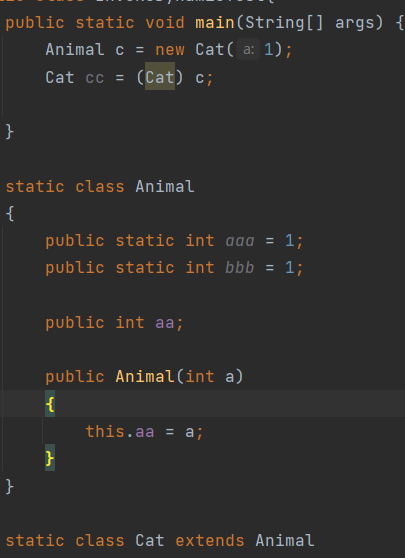
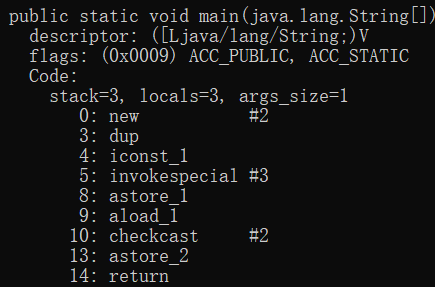

## 字节码指令介绍（三）
在本部分的最后，将讲解对象操作指令、操作数栈操作指令。

#### 本篇目的：
* 对象操作指令、操作数栈操作指令

### 一、对象操作指令
虽然类的对象和数组在Java虚拟机中都被认为是对象，但在指令集中有着完全不同的指令。

#### 对象创建指令
包含一个指令：`new`。

该指令后面跟两个字节，拼接起来的常量指向常量池中的一个`Class`型常量，代表该对象的类。

然而当对象创建后，还需要在之后使用`invoke`族指令调用构造方法后才会完成。当对象创建后，操作数栈自动压入一个该对象。

#### 数组对象创建指令
包含三个指令：`newarray`、`anewarray`、`multianewarray`。

对于`newarray`指令，创建一个基本类型数组对象。后面只跟一个字节，代表其类型。类型关系和字节如下表：

| 类型 | 字节 |
|:------------:|:-----------:|
| boolean      | 4           |
| char         | 5           |
| float        | 6           |
| double       | 7           |
| byte         | 8           |
| short        | 9           |
| int          | 10          |
| long         | 11          |

之后会在操作数栈顶弹出一个数字，为其大小，创建后将一个数组对象压入栈中。

对于`anewarray`指令，创建一个任意类型的数组对象。后面跟两个字节，拼接起来的常量指向常量池中的一个`Class`型常量，代表该数组元素对象的类。

之后会在操作数栈顶弹出一个数字，为其大小，创建后将一个数组对象压入栈中。

对于`multianewarray`指令，创建一个**包括基本数据类型在内**的任意类型的多维数组对象。后面跟两个字节，拼接起来的常量指向常量池中的一个`Class`型常量，代表该数组元素对象的“类”。

这个“类”将在常量池中以**描述符**的形式存储。例如：`char[][]`在常量池中所对应的就是`[[C`。

之后会在操作数栈顶弹出若干个数字（与维数相同），为其大小，创建后将一个数组对象压入栈中。

#### 字段访问指令
包含4条指令：`getstatic`、`putstatic`、`getfield`、`putfield`。

前两个对类的字段（static）进行操作，后者操作对象的字段（非static）。

操作过程与`load/store`指令类似：

`getstatic`后面跟两个字节，拼接后指向常量池中的一个`Fieldref`型的字段。将在操作数栈中加载这一字段。

`putstatic`后面跟两个字节，拼接后指向常量池中的一个`Fieldref`型的字段。操作数栈顶弹出一个字段，并在常量池中更新。

`getfield`后面跟两个字节，拼接后指向常量池中的一个`Fieldref`型的字段。将在操作数栈顶弹出一个对象，之后再在栈中加载该对象的字段。

`putfield`后面跟两个字节，拼接后指向常量池中的一个`Fieldref`型的字段。操作数栈顶弹出一个对象和一个字段，并在常量池中更新。

#### 数组长度指令
包含1条指令：`arraylength`。

该指令将在操作数栈顶弹出一个数组对象，对其取长度后压入栈中。对于多维数组，取**第一维的长度**。

#### 检查对象类型指令
包含2条指令：`instanceof`、`checkcast`。

`instanceof`关键字相信大家都不陌生。这个语句格式为：`a instanceof A`，`a`为一个对象，`A`为一个类，来检查`a`是不是`A`的一个实例。

对于这条字节码指令，前者后面跟两个字节，拼接后指向常量池中的一个`Class`类型的常量。代表`A`；将在操作数栈中弹出一个对象`a`，运算后将一个`int`型的数压入操作数栈中，`1`代表是，`0`代表不是。（实际上可以理解为压入一个`boolean`类型的结果）

`checkcast`关键字和前者十分类似。

对于这条字节码指令，前者后面跟两个字节，拼接后指向常量池中的一个`Class`类型的常量。代表`A`；将在操作数栈中弹出一个对象`a`，检查`a`是否可转换为`A`型。如果可以，将`a`重新压入栈，即操作数栈不变；否则抛出`ClassCastException`异常。

在强制类型转换过程，如果`checkcast`指令成功执行，那么局部变量表中**被转的类型的一个字段**会被直接`astore`为**转换的类型的字段**，具体可见下图：

### 二、操作数栈操作指令
为了方便，Java虚拟机指令集中添加了直接操作操作数栈的指令：
* `pop`、`pop2`指令：弹出一个或两个元素。
* `dup`指令：复制栈顶元素一份： |a| -> |a|a|
* `dup2`指令：复制栈顶元素一份： |a| -> |a|a|

### 习题
1. 思考“常量池”中的“常量”是真的在整个运行周期内不改变的吗？
2. 其他习题待补充……

本篇参考资料：
1. 《深入理解JAVA虚拟机：JVM高级特性与最佳实践（第3版）》 周志明著
