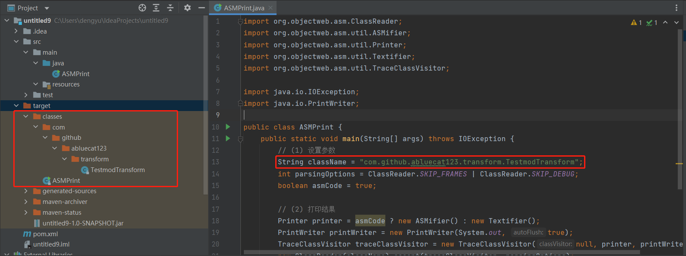

## ASM介绍
ASM是一款通用的Java字节码操作和分析框架。它可以用于修改**已有的类**或直接以二进制形式动态**生成**类。ASM提供了一些常见的字节码转换和分析算法，可以从中构建自定义的复杂转换和代码分析工具。ASM提供了与其他Java字节码框架类似的功能，但侧重于性能。因为它被设计和实现为尽可能小和快，所以非常适合在动态系统中使用（当然也可以以静态方式使用，例如在编译器中）。

?> **提示** 对于ASM的名称来源，ASM官方用户手册（见参考资料1）第二页明确：这个名称不是任何单词的缩写，只是对C语言中`__asm__`关键字的一个引用。ASM本身只是一个名字，不要把它和assembler（汇编）、内联汇编等进行联系。事实上，根据前两部分的介绍，字节码和汇编有着很大不同。

#### 本篇目的：
* 介绍ASM的框架、相关概念及重要参考资料

### ASM的重要参考资料
由笔者的水平、本教程的篇幅等所限，加上参考资料对其的讲解十分详细，因此本文更倾向于**应用**的方面来介绍ASM。这里列出两个重要的参考资料，请读者先行**熟悉**：
* ASM官方用户手册(英文) https://asm.ow2.io/asm4-guide.pdf
* Java ASM系列 lsieun的博客 https://blog.51cto.com/lsieun/2924583

大家可能已经发现，这些资料都很详细、内容丰富，但也十分长。如果要完整学习这些教程之后再学习本教程、然后再实际操作逆向，时间成本过大，因此笔者更建议将其像之前的字节码指令表一样当做**工具书**使用，即随用随查。实际上对于包括本教程内的任何教程也是如此，用到时再参考即可。

### ASM框架
对于ASM的原理，按笔者的理解：由于Java的字节码文件的各个组成部分都十分明确，且各指令对应的字节都是规定好的。因此，按照字节码类型出现的顺序关系，还原出整个.class文件并非难事。

ASM由Core API 和 Tree API 组成。本教程将只初步介绍Core API。

#### 环境的搭建
引入maven依赖：
```xml
    <properties>
        <asm.version>8.0.1</asm.version>
    </properties>

    <dependencies>
        <dependency>
            <artifactId>asm-commons</artifactId>
            <groupId>org.ow2.asm</groupId>
            <version>${asm.version}</version>
        </dependency>

        <dependency>
            <artifactId>asm-util</artifactId>
            <groupId>org.ow2.asm</groupId>
            <version>${asm.version}</version>
        </dependency>
    </dependencies>
```
对于部分JDK，可能会有`jdk.internel.org.objectweb.asm`包，这样就不需要引用这个依赖了。

### ASMPrint类使用介绍
?> **声明** 根据[lsieun原作者仓库](https://github.com/lsieun/learn-java-asm)的MIT许可协议，来自该仓库的代码在包含版权声明后允许分发和使用，因此本教程也直接引用源代码。请读者按要求进行使用。

在正式介绍之前，需要介绍ASMPrint类。它利用TraceClassVisitor将.class文件转化为ASM代码，在初学时可以代码如下：

```java
import org.objectweb.asm.ClassReader;
import org.objectweb.asm.util.ASMifier;
import org.objectweb.asm.util.Printer;
import org.objectweb.asm.util.Textifier;
import org.objectweb.asm.util.TraceClassVisitor;

import java.io.IOException;
import java.io.PrintWriter;

public class ASMPrint {
    public static void main(String[] args) throws IOException {
        // (1) 设置参数
        String className = "sample.HelloWorld";
        int parsingOptions = ClassReader.SKIP_FRAMES | ClassReader.SKIP_DEBUG;
        boolean asmCode = true;

        // (2) 打印结果
        Printer printer = asmCode ? new ASMifier() : new Textifier();
        PrintWriter printWriter = new PrintWriter(System.out, true);
        TraceClassVisitor traceClassVisitor = new TraceClassVisitor(null, printer, printWriter);
        new ClassReader(className).accept(traceClassVisitor, parsingOptions);
    }
}
```

在使用时，对于有包名的.class文件，应该在**生成字节码的目录下**，创建多个文件夹，使之形成类的全限定名结构，然后把.class文件放进去。可参考下图：




这样就可以输出字节码文件对应的ASM代码了。

### ASM重要类型介绍

ASM包含以下重要的类：`ClassVisitor`、`ClassWriter`、`ClassReader`类。

ClassVisitor 类是一个抽象类，代表对类操作的一些方法。它定义了关于访问一个类的多种静态方法，也就是`visitXXX`方法。它们对字节码文件的组成（包括包括类的方法、相关属性、内部类、注解等）进行全方位的访问。它本身的方法都只有形式化的调用下一级ClassVisitor的功能，没有实际上的实现。它有多个子类：ClassWriter、ClassNode、ClassRemapper、TraceClassVisitor等诸多类。这里只介绍ClassWriter类。

ClassWriter 类便继承并实际实现了“怎么创造一个类”的诸方法。在初始化 ClassWriter 类的对象后，里面的新增或修改操作由MethodVisitor、FieldVisitor、AnnotationVisitor等Visitor承担。注意：这里的Visitor和ClassVisitor抽象类**完全无关**，读者请勿混淆。

在做完所有工作后，调用该对象的`toByteArray()`方法，将之转化为字节数组的形式，这个字节数组存储的便是利用ClassWriter生成的Java字节码，其显然遵循Java字节码规范。这个数组可直接填入.class文件生成字节码文件。

ClassReader 类可以对已有的类进行修改。这个类一般需要配合自定义的ClassVisitor子类。正如ClassWriter类是“怎么创造一个类”一样，这个自定义的ClassVisitor子类是自己定义的“怎么修改这个类”的具体方法。

这三个类的具体使用，请见下一节。

本篇参考资料：
1. ASM官方用户手册 https://asm.ow2.io/asm4-guide.pdf
2. Java ASM系列 lsieun的博客 https://blog.51cto.com/lsieun/2924583