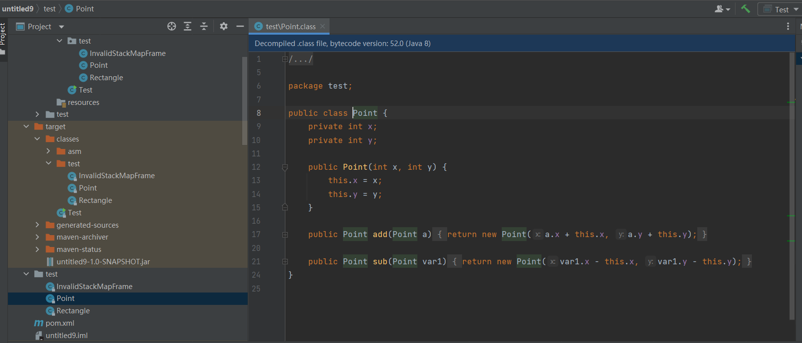

## Javassist 介绍及使用
Javassist是一个处理Java字节码的类库。它学习起来远比ASM框架简单，且可以不需要直接操作字节码指令来修改字节码数据。它提供了一套类似于脚本的修改类的简单办法，甚至有一套面向源代码级别的API。这使得用它操作字节码十分方便。

对于这个工具与ASM框架的对比，多篇文章<sup>[2-4]</sup>指出：ASM拥有的优点是性能好、灵活性高、操作字节码能力强大；而javassist的优点是入门上手简单（不需要了解字节码指令也能掌握），实现较快。

#### 本篇目的：
* 介绍javassist的使用

### 引入javassist依赖
在Github上下载[最新的javassist发布版本](https://github.com/jboss-javassist/javassist)，在工程里面引入它作为依赖即可。

### javassist的基本类

#### CtClass与ClassPool简介

javassist用来处理类的最基本的单位是`CtClass`，也就是运行时类。一个CtClass对象可以处理一个.class文件。获取CtClass对象的方式是从默认类池（ClassPool）里面获取，代码如下：

```java
ClassPool pool = ClassPool.getDefault();
CtClass cc = pool.get("xxx"); //此处填写类的全限定类名
```

如果想创建一个新类，可以直接调用`makeClass("xxx")`方法生成。

对于CtClass对象，可以用`writeFile()`方法直接生成字节码文件，也可以用`toBytecode()`来获取字节数组。

#### CtXXX族类简介

以`Ct`开头的类十分多，可以修改或新建相应的目标。

现介绍`CtNewNethod`和`CtMethod`的用法：

现有一个Point类，作为操作点的一个类，其定义如下：

```java
package test;

public class Point {
    private int x;
    private int y;
    public Point(int x, int y)
    {
        this.x = x;
        this.y = y;
    }

    public Point add(Point a)
    {
        return new Point(a.x + this.x, a.y + this.y);
    }
}
```

现需要加入一个sub()方法，其定义如下：
```java
    public Point sub(Point a)
    {
        return new Point(a.x - this.x, a.y - this.y);
    }
```

可编程如下：
```java
    public static void main(String[] args) throws Exception{
        ClassPool pool = ClassPool.getDefault();
        CtClass ctClass = pool.get("test.Point");
        CtMethod method = CtNewMethod.make("public test.Point sub(test.Point a)\n" +
                "    {\n" +
                "        return new test.Point(a.x - this.x, a.y - this.y);\n" +
                "    }", ctClass);
        ctClass.addMethod(method);
        ctClass.writeFile();
    }
```
注意：此处必须使用全限定类名来描述Point类，因为没有import。

结果如下：（类生成在工程根目录下，而不是在target目录内，因为这属于生成结果）



**替换方法体：**

如果需要将一个方法的方法体替换为一个新的方法体，可以直接用`setBody()`方法完成。例如如果要把上文的`add()`方法变成两点相减，可以这样完成：

```java
    public static void main(String[] args) throws Exception{
        ClassPool pool = ClassPool.getDefault();
        CtClass ctClass = pool.get("test.Point");
        CtMethod method1 = ctClass.getDeclaredMethod("add");
        method1.setBody("return new test.Point($1.x - this.x, $1.y - this.y);");
        ctClass.writeFile();
    }
```

其中，由于在javassist的处理过程中，变量没有其名字，`$1`指的是“第一个参数”。参数从左到右从1开始，`$0`对于非静态方法来说指的是“this”对象，而对于静态方法来说`$0`不可用。

此外，还有在方法体前或后面、按行号加代码的方式。这里可以看出，javassist的使用十分方便。[参考资料5](https://www.jianshu.com/p/43424242846b)给出了javassist wiki 的中译本，读者可参考。

本篇参考资料：
1. Javassist wiki: https://github.com/jboss-javassist/javassist/wiki
2. javassist、ASM 对比: https://www.jianshu.com/p/eb05c5b952ce
3. Javassist/ASM 框架比较: https://www.cnblogs.com/xd502djj/p/13062165.html
4. javassist用法&asm用法以及区别 https://www.cnblogs.com/qlqwjy/p/15216085.html
5. Javassist 使用指南（一）https://www.jianshu.com/p/43424242846b