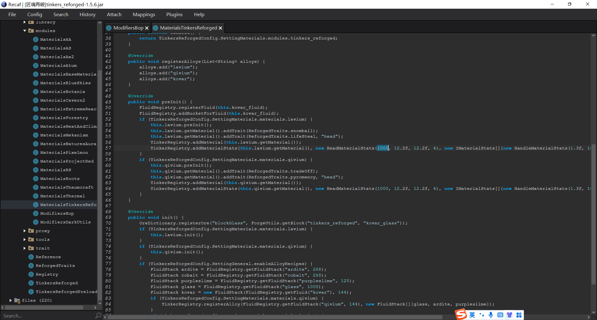
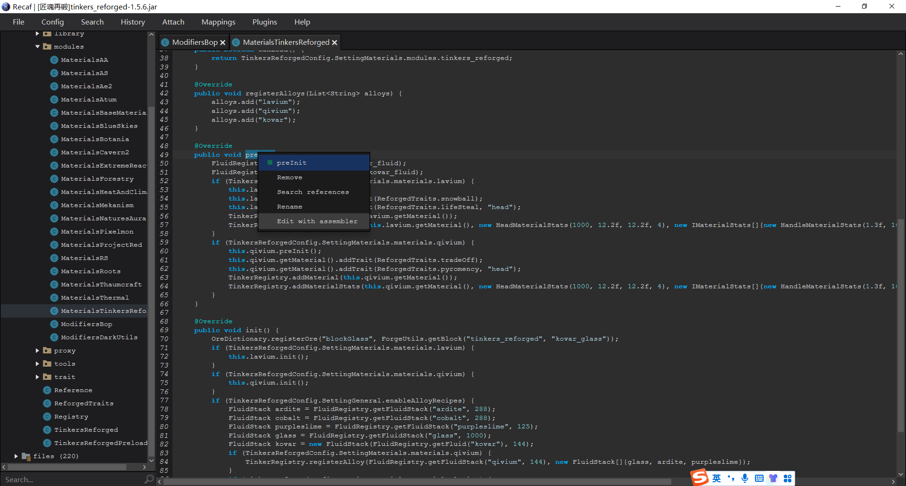
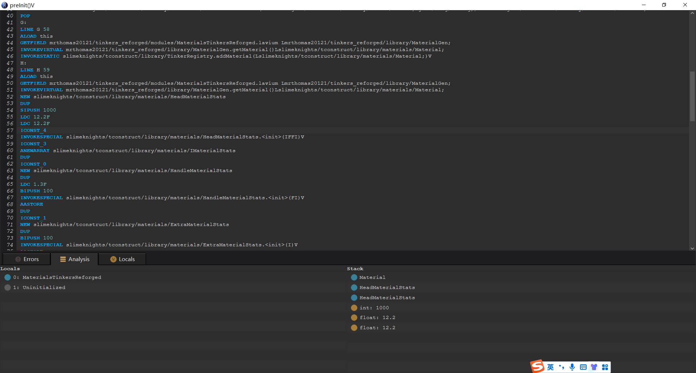
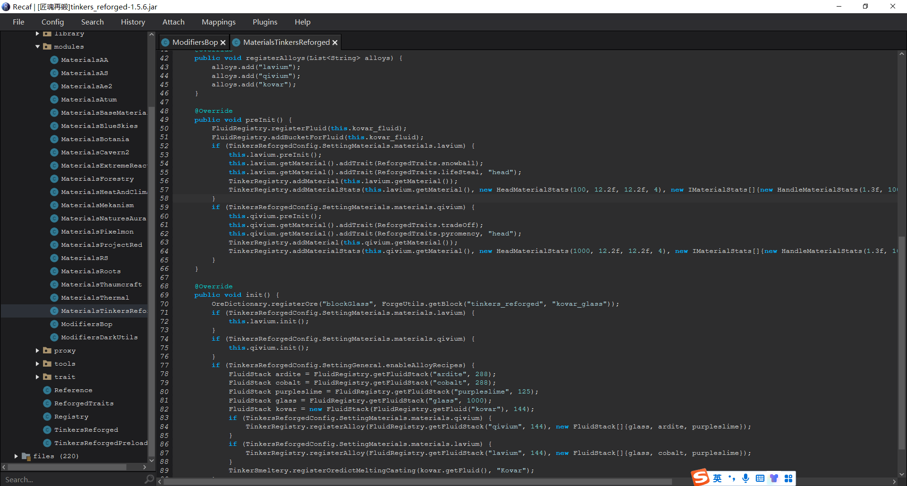

## 使用Recaf直接修改字节码
Recaf 在之前介绍反编译器的时候便已经提到过了。但直到现在才开始讲解其直接修改字节码的强大功能。实际上笔者认为这节都可以不用说，因为实在太简单了；但同时又觉得这节必须说，因为十分方便和重要。因此，笔者单开了一节来讲解Recaf直接修改字节码的方法。

#### 本篇目的：
* 讲解Recaf直接修改字节码的方法。

### Recaf直接修改字节码的办法
首先，**使用JDK**打开Recaf，版本推荐在Java 11以上，并找到要修改的地方。

现假定我要修改选中的1000，将其改为100。右键点击`preInit()`，点击Edit with assembler：

我们可以看到，这里可以显示操作数栈的状态。

考虑到这个1000肯定是个立即数，那么我们找第一个`SIPUSH 1000`，将其修改为100，按`Ctrl+S`组合键保存，于是：

我们可以看到，这里在源代码层面已经修改成功了。单击File--Export program 即可导出修改后的jar。

?> **提示** 或许读者已经注意到，`INVOKESPECIAL`等指令原本后面应该跟字节，字节代表常量池中的相应常量，但这里的字节码却直接就是全限定名+描述符的形式。实际上后者这样修改更为简单，但语义确实发生了一些改变。无论如何，请读者阅读参考资料，获得Recaf所用字节码指令的含义。

### 优缺点
使用Recaf进行修改字节码，十分方便快捷。但缺点也很明显：这是静态修改字节码。即我们不能将其作为一个mod来修改字节码，而是只能分发修改后的文件。因此这种方法适合修改获得授权的程序或者汉化插件等，但不适合于修改不得散布修改后程序的软件。

本篇参考资料：
1. Recaf wiki: https://www.coley.software/Recaf-documentation/use-assembler.html