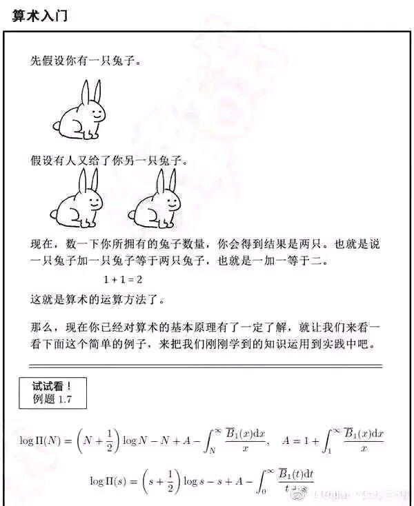

## Project 1: 修复游戏漏洞

!> **注意** 本教程的**大工程**(Project, PJ)是教程的重要实践部分。原则上需要读者完成一定量的PJ内容才能视为“学有所得”。因此如果有机会还请实践完成。

### 背景

——“Mojang 真是一条懒狗！”，贺兰气愤地说道，

——“什么是懒狗?”，绵羊问，

——“什么是 Mojang?”，蓝猫问，

——“什么是麻将?”，呱太问。

（以上纯属瞎扯）

### PJ描述

曾经的某个时候，MC圈子还是比较和谐的 —— 在MC刚刚出现的时间里，那段田园诗般的时光，或许仍然深藏在许多玩家心中。然而，随着MC原版、插件或mod的bug被发现得越来越多，这些漏洞被一些人利用，污染了圈子的生态。

在2020年，mod圈子里爆发出了严重的bug——minecraft 1.12版本大量模组被攻破，作弊模组严重影响到了游戏的公平性。（详细情况可参考[这里](https://bdn.tdiant.net/#/unit/1-5)）虽然后来成功出了一款[优秀的修复模组](https://www.mcbbs.net/thread-857865-1-1.html)，但这也不得不让我们思考：

**只靠开发者，真的能解决一切问题吗？**

你已经完成了前两章的学习了。虽然你可能不相信，但你确实已经具备了一定的逆向能力，已经可以去尝试修复游戏、插件、mod里存在的一些bug了 —— 是的，并不是像广为流传的下图[1]那样：

而是你**真的**已经有能力为我们所热爱的游戏贡献力量了。

!> **注意** 记得时刻遵守Mojang EULA。即使你可能是出于“修复游戏漏洞”的好心修改了游戏，但还请**不要分发游戏本体文件**，因为这是违反EULA的行为！如果你确实要分享，分享修复mod/扩展包就行。

本教程将在下一页介绍两种方法来修复bug/修改游戏：编写MOD、修改字节码文件、编写ACBF扩展包。实际上，方法远不止这么点，更多方法还请自己探索。

如果你不知道漏洞从何修起，可以参考以下的方案：
* 查看**Mojira**(Mojang 漏洞追踪器): https://bugs.mojang.com/projects/MC/issues
* 在你所热爱的mod/插件那里对应的 github 项目的 **issues** 区域，当然你如果能提交PR那更好。
* 尝试修复Multiverse-Core 4.3.0及以下版本存在的崩服问题(此问题已在4.3.1版本修复)：https://www.spigotmc.org/resources/multiverse-core.390/history https://github.com/Multiverse/Multiverse-Core/issues/2703
* 尝试实现以下小功能：落地水仍然可以受到掉落伤害、末影龙死后一段时间自动重生。
* 尝试实现以下极小功能：修改玩家生命上限、饱食度上限，玩家锁血。

最后，笔者想说，逆向工程的路本来就充满了坎坷，但唯有勇气，是支持我们向前的动力。

> 一路向前,且行且歌。

本篇参考资料：
1. 此图是互联网上著名的梗图，具体来源已不可考。本教程以“合理使用”的目的使用此图片。