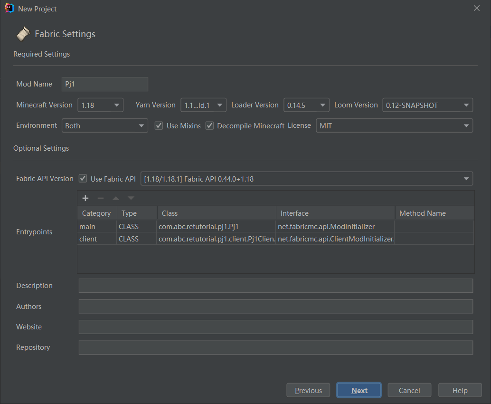
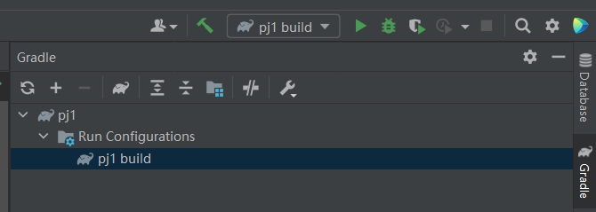
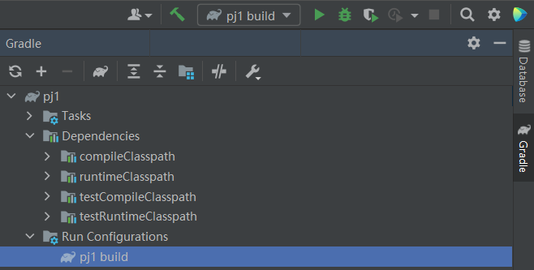
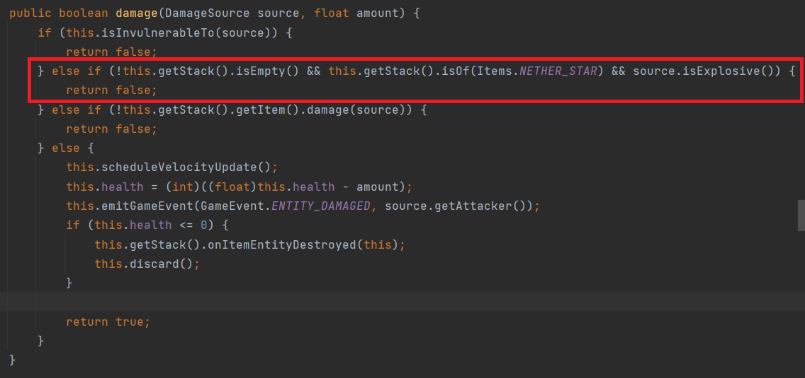
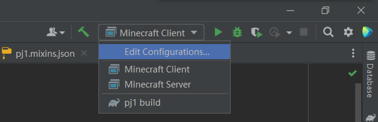
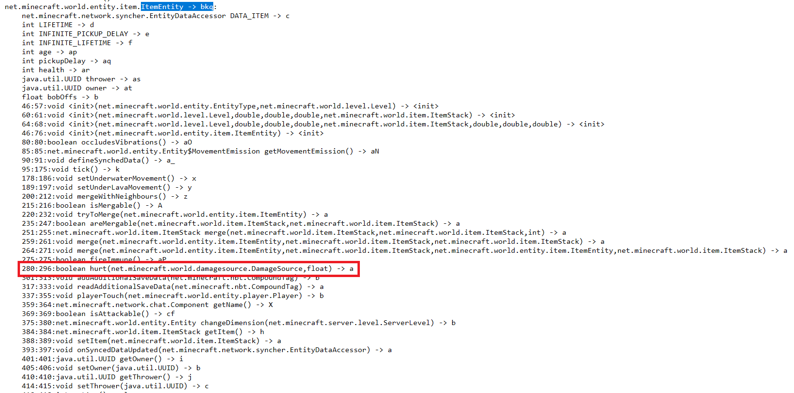
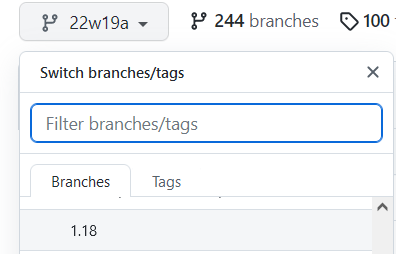
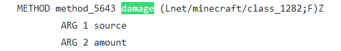
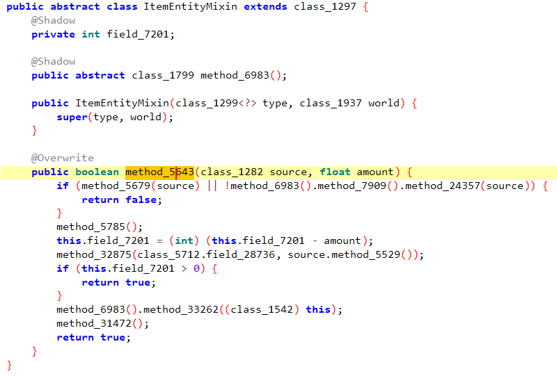
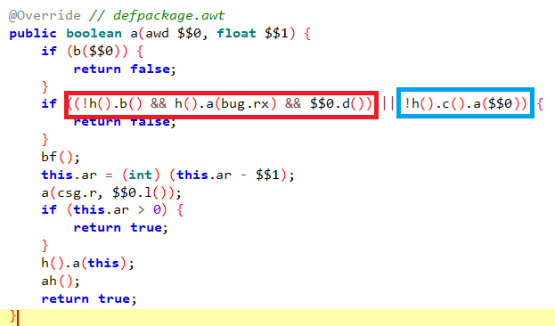

## Project1-Complement 两种修复方式

?> **提示** 受笔者水平所限，本篇可能并不会非常完善，笔者很高兴读者能对此进行批评指正。若有任何想法，欢迎使用本教程主页的联系方式直接联系笔者。

本篇将介绍用于完成PJ1的两种方式：编写MOD、修改字节码文件。

对于这两种方式，基本上有以下适用情况：

* 编写MOD：适用于修改**原版游戏、mod**
* 修改字节码文件：适用于修改(未被混淆或轻度混淆的)**插件、mod**

本篇将以Minecraft 1.18为基，用两种方式实现“取消下界之星的爆炸保护”的功能。

### 零、前期准备

接下来工作都是在IDEA上面进行的。建议安装Minecraft Development Plugin。

### 一、编写MOD
这一部分讲解编写**Fabric MOD**来达成修改游戏的目的。

#### 第一步 创建工程
首先创建Fabric工程，可参考的配置如图：


#### 第二步 换源(可选)
打开settings.gradle, 把`https://maven.fabricmc.net/`修改为`https://lss233.littleservice.cn/repositories/minecraft`，若更换下载源后出现下载失败的问题，可以更换回来。

#### 第三步 构建
点击右侧的`pj1 build`(若没有，可以点击最右边的`Gradle`调出)，等待构建过程。


然后，点击`Reload All Gradle Projects`，等待下载文件。

?> **要耐心** 这一步可能会反复出错导致构建失败，且等待时间很漫长，如果失败可以尝试多试几次。

当你看到这些的时候，证明你构建成功了：


#### 第四步 定位
?> 本部分参考了[《由现象到本质的Minecraft源码注入艺术》](https://www.mcbbs.net/thread-1205392-1-1.html)，强烈建议读者在继续阅读本文之前仔细阅读该教程。

我们思考，在**实体状态**下的下界之星并不会因为爆炸而导致摧毁，故我们很容易想到要找ItemEntity类，找到damage方法：



非常明显了：只要伤害来源是爆炸，且物品是下界之星，就不摧毁它。既然明白了工作原理，只要我们去掉这个判断就成了。

#### 第五步 编写代码
我们在主类所在的文件夹创建一个`mixin`子包，里面创建一个名为`ItemEntityMixin`的类，内容如下：

```java
package com.abc.retutorial.pj1.mixin;

import net.minecraft.entity.Entity;
import net.minecraft.entity.EntityType;
import net.minecraft.entity.ItemEntity;
import net.minecraft.entity.damage.DamageSource;
import net.minecraft.item.ItemStack;
import net.minecraft.world.World;
import net.minecraft.world.event.GameEvent;
import org.spongepowered.asm.mixin.Mixin;
import org.spongepowered.asm.mixin.Overwrite;
import org.spongepowered.asm.mixin.Shadow;

@Mixin(ItemEntity.class)
public abstract class ItemEntityMixin extends Entity {

    public ItemEntityMixin(EntityType<?> type, World world) {
        super(type, world);
    }

    @Shadow public abstract ItemStack getStack();
    @Shadow private int health;
    /**
     * @author ABlueCat
     * @reason A suggested example for Project 1.
     */
    @Overwrite()
    public boolean damage(DamageSource source, float amount) {
        if (this.isInvulnerableTo(source)) {
            return false;
        } else if (!this.getStack().getItem().damage(source)) {
            return false;
        } else {
            this.scheduleVelocityUpdate();
            this.health = (int)((float)this.health - amount);
            this.emitGameEvent(GameEvent.ENTITY_DAMAGED, source.getAttacker());
            if (this.health <= 0) {
                this.getStack().onItemEntityDestroyed((ItemEntity) (Object)this);
                this.discard();
            }

            return true;
        }
    }
}
```
为了让模组能正常运行，主类也应该实现`onInitialize()`方法(虽然什么都不用做倒是)：
```java
package com.abc.retutorial.pj1;

import net.fabricmc.api.ModInitializer;

public class Pj1 implements ModInitializer {

    @Override
    public void onInitialize() {

    }
}
```
然后，删除fabric.mod.json中client部分和client类，就写完了这个模组。

接下来把启动配置改成`Minecraft Client`，点击运行键，就可以看看效果了！



如果有编写Forge Mod的需要，可参考[这篇博客](https://mouse0w0.github.io/2022/03/01/Mixins-on-Minecraft-Forge/)，本文将不再赘述。

### 二、修改字节码
有必要说明的是，修改字节码的方法并不是很适用于修复原版游戏的漏洞。但也并不是不可以这样做。

?> **说明** 本文这一部分使用的是**Minecraft的官方映射表**。该表在快照[19w36a](https://minecraft.fandom.com/zh/wiki/19w36a)及之后的所有版本都会发布<sup>[2]</sup>。

首先，我们定位到.minecraft\versions\1.18\1.18.json，打开文件并格式化文档后，找到：
```json
"client_mappings": {
    "sha1": "e824c89c612c0b9cb438ef739c44726c59bbf679",
    "size": 6610979,
    "url": "https://launcher.mojang.com/v1/objects/e824c89c612c0b9cb438ef739c44726c59bbf679/client.txt"
},
```

!> **注意** 由于官方的混淆映射表和yarn映射表不一定完全一样，所以请勿一味地寻找完全一致的类名方法名，否则可能找不到。

打开url文件，即可获得其混淆映射表。猜测性查找`ItemEntity`，找到了：



可以注意到，`ItemEntity`类已被混淆为`bkq`类，而我们在该类中关注到了一个很感兴趣的`hurt`方法，这个和yarn表中的`damage`方法非常接近，基本可以断定就是它了。

---

?> **说明** 本文这一部分使用的是**Yarn映射表**。

进入Yarn的[仓库](https://github.com/FabricMC/yarn/)，选择`1.18`分支：



之后进入`mappings/net/minecraft/entity/ItemEntity.mapping`，找到第一句：`CLASS net/minecraft/class_1542 net/minecraft/entity/ItemEntity`，这句话说明`ItemEntity`对应的Searge名为`class_1542`。

再进入[intermediary仓库](https://github.com/FabricMC/intermediary)，定位`mappings/1.18.tiny`，查找`class_1542`可发现：`CLASS	 bkq net/minecraft/class_1542`字样，这说明了这个类最终对应的混淆名为`bkq`，和我们上文得到的结果完全一致。

> 等等，那方法的映射呢？

部分读者可能已经发现了，在`ItemEntity.mapping`里面没有`damage`方法，却有`getRotation`、`copy`等诸多方法。消失的方法也不止有`damage`方法一个，`isFireImmune`等**复写方法**也不见了……

没错，要在父类找。因为复写方法实际上继承了父类方法的Searge名，故要在父类找。



再逆向一下我们第一部分得到的Fabric Mod，可以看到：



所以，真相到此水落石出了。再在`mappings/1.18.tiny`下面查找`method_5643`, 找到`METHOD awt (Lawd;F)Z a method_5643`，可以得知该方法对应的混淆名是`a`。

---

使用jadx打开.minecraft\versions\1.18\1.18.jar，找到`bkq`类，看到这个：



因为整个类中只有这个类有**两个参数且一个参数为float**，那么这个类毫无意外一定是hurt(damage)方法。因此，我们就可以利用第二部分学到的技能直接去掉红框内判断条件即可。

?> **说明** 为什么是红框内判断条件呢？实际上和yarn反混淆后的源码对比，加上逻辑的判断，基本上可以确定红框内对应的就是`if (!this.getStack().isEmpty() && this.getStack().` `isOf(Items.NETHER_STAR) && source.isExplosive())`判断条件,蓝框内对应的就是`if (!this.getStack().getItem().damage(source))` 判断条件。当然这些都是**经验上的**判定，如果不放心，请自行继续分析语义后再继续修改。

!> **注意** 再次提请注意， **散布修改版Minecraft<u>客户端</u>的行为违反[Minecraft最终用户许可协议](https://account.mojang.com/documents/minecraft_eula)** 。

既然目标明确，那就可以动手修改了。(修改过程略，请自行参考第二部分进行修改)

最终效果：

<iframe height=516 width=856 src="pj1/video/pre.mp4">

本篇参考资料：
1. 由现象到本质的Minecraft源码注入艺术 https://www.mcbbs.net/thread-1205392-1-1.html
2. 混淆映射表 中文Minecraft Wiki https://minecraft.fandom.com/zh/wiki/%E6%B7%B7%E6%B7%86%E6%98%A0%E5%B0%84%E8%A1%A8
3. 耗子的博客: https://mouse0w0.github.io/
4. Yarn项目: https://github.com/FabricMC/yarn/
5. intermediary项目: https://github.com/FabricMC/intermediary
6. Fabric Wiki Tutorial: https://fabricmc.net/wiki/tutorial:setup